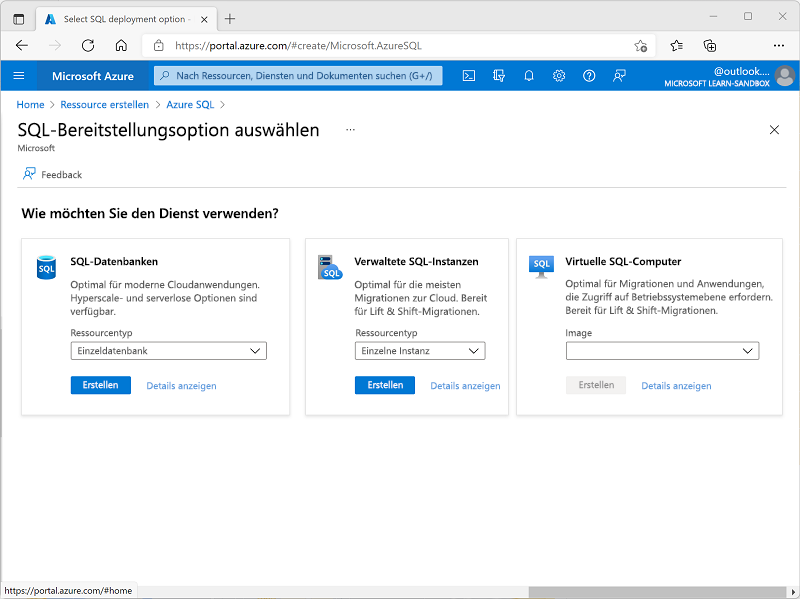
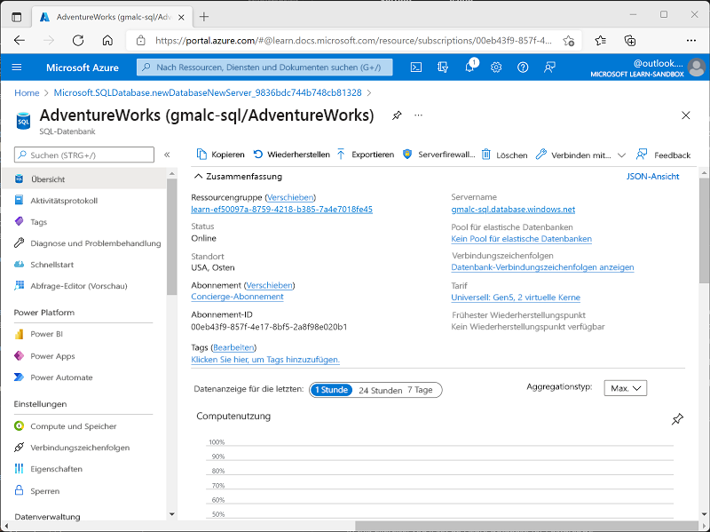
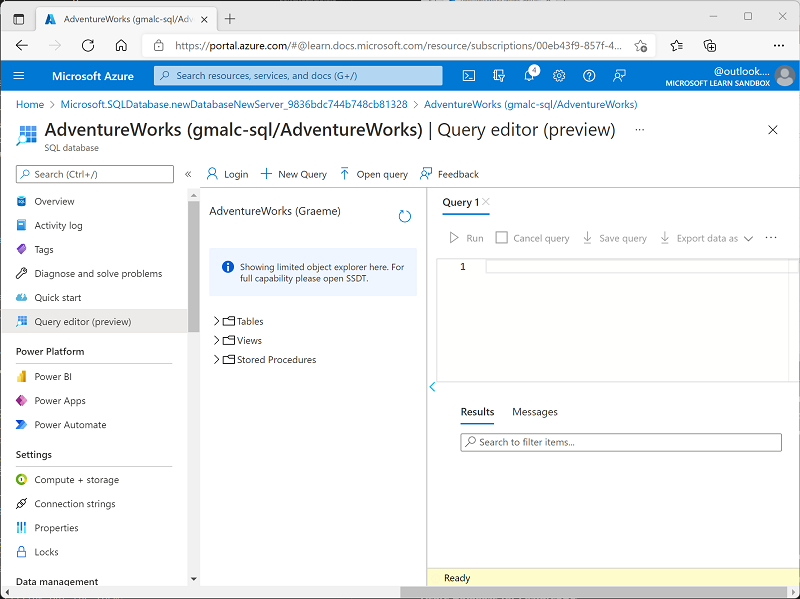

---
lab:
  title: Einführung in Azure SQL-Datenbank
  module: Explore relational data in Azure
---

# <a name="explore-azure-sql-database"></a>Einführung in Azure SQL-Datenbank

In dieser Übung stellen Sie eine Azure SQL-Datenbankressource in Ihrem Azure-Abonnement bereit und verwenden dann SQL, um die Tabellen in einer relationalen Datenbank abzufragen.

Dieses Lab dauert ungefähr **15** Minuten.

## <a name="before-you-start"></a>Vorbereitung

Sie benötigen ein [Azure-Abonnement](https://azure.microsoft.com/free), in dem Sie Administratorzugriff besitzen.

## <a name="provision-an-azure-sql-database-resource"></a>Bereitstellen einer Azure SQL-Datenbankressource

1. Klicken Sie im [Azure-Portal](https://portal.azure.com?azure-portal=true) links oben auf **&#65291; Ressource erstellen**, und suchen Sie nach *Azure SQL*. Klicken Sie auf der angezeigten Seite **Azure SQL** auf **Erstellen**.

1. Überprüfen Sie die verfügbaren Azure SQL-Optionen. Vergewissern Sie sich, dass auf der Kachel **SQL-Datenbanken** die Option **Einzeldatenbank** ausgewählt ist, und klicken Sie auf **Erstellen**.

    

1. Geben Sie auf der Seite **SQL-Datenbank erstellen** die folgenden Werte ein:
    - **Abonnement**: Wählen Sie Ihr Azure-Abonnement.
    - **Ressourcengruppe**: Erstellen Sie eine neue Ressourcengruppe mit einem Namen Ihrer Wahl.
    - **Datenbankname**: *AdventureWorks*
    -                 **Server**: Wählen Sie die Option **Neu erstellen** aus, und erstellen Sie einen neuen Server mit einem eindeutigen Namen an einem verfügbaren Standort Ihrer Wahl. Verwenden Sie die **SQL-Authentifizierung**, und geben Sie Ihren Namen als Serveradministrator und ein ausreichend komplexes Kennwort an. Notieren Sie sich das Kennwort, da sie es später benötigen.
    - **Möchten Sie einen Pool für elastische SQL-Datenbanken verwenden?**: *Nein*
    - **Compute + Speicher**: Lassen Sie den Wert unverändert.
    - **Redundanz für Sicherungsspeicher**: *Lokal redundanter Sicherungsspeicher*
    - Klicken Sie auf der Seite **SQL-Datenbank erstellen** auf **Weiter: Netzwerk >** . Klicken Sie anschließend auf der Seite **Netzwerk** im Abschnitt **Netzwerkkonnektivität** auf **Öffentlicher Endpunkt**.

1. Wählen Sie im Abschnitt **Firewallregeln** für beide Optionen **Ja** aus, um den Zugriff auf Ihren Datenbankserver von Azure-Diensten und Ihrer aktuellen Client-IP-Adresse aus zuzulassen. Klicken Sie auf **Weiter: Sicherheit >** , und legen Sie für **Microsoft Defender für SQL aktivieren** die Option **Nicht jetzt** fest.

1. Klicken Sie auf **Weiter: Zusätzliche Einstellungen >** . Legen Sie auf der Registerkarte **Zusätzliche Einstellungen** für **Vorhandene Daten verwenden** die Option **Beispiel** fest. Dadurch wird eine Beispieldatenbank erstellt, die Sie sich später ansehen können.

1. Klicken Sie zum Erstellen Ihrer Instanz von Azure SQL-Datenbank auf **Überprüfen + erstellen** und dann auf **Erstellen**.

1. Warten Sie, bis die Bereitstellung abgeschlossen ist.

1. Wechseln Sie anschließend zu der bereitgestellten Ressource, die wie folgt aussehen sollte: Screenshot: Azure-Portal mit der Seite „SQL-Datenbank“

    

1. *Wird eine Fehlermeldung mit dem Hinweis angezeigt, dass die Client-IP-Adresse nicht zulässig ist, klicken Sie auf den Link **Liste zugelassener IP-Adressen...** am Ende der Nachricht, um den Zugriff zu gewähren. Versuchen Sie dann erneut, sich anzumelden. (Sie haben zwar zuvor die Client-IP-Adresse Ihres Computers den Firewallregeln hinzugefügt, doch je nach Netzwerkkonfiguration stellt der Abfrage-Editor möglicherweise eine Verbindung von einer anderen Adresse aus her.)*
    
    Der Abfrage-Editor sieht folgendermaßen aus:
    
    Screenshot: Azure-Portal mit dem Abfrage-Editor
    
    

1. Geben Sie im Bereich **Abfrage 1** den folgenden SQL-Code ein:

1. Klicken Sie oberhalb der Abfrage auf **&#9655; Ausführen**, um die Abfrage auszuführen und die Ergebnisse anzuzeigen. Diese sollten wie nachstehend gezeigt sämtliche Spalten aller Zeilen der Tabelle **SalesLT.Product** enthalten:

    ```sql
    SELECT * FROM SalesLT.Product;
    ```

1. Screenshot: Azure-Portal mit dem Abfrage-Editor und den Abfrageergebnissen

    

1. Führen Sie nun die folgende Abfrage aus, die mithilfe von JOIN den Kategorienamen aus der Tabelle **SalesLT.ProductCategory** abruft:

    ```sql
    SELECT ProductID, Name, ListPrice, ProductCategoryID
    FROM SalesLT.Product;
    ```

1. Schließen Sie den Bereich des Abfrage-Editors, und verwerfen Sie Ihre Bearbeitungen.

    ```sql
    SELECT p.ProductID, p.Name AS ProductName,
            c.Name AS Category, p.ListPrice
    FROM SalesLT.Product AS p
    JOIN [SalesLT].[ProductCategory] AS c
        ON p.ProductCategoryID = c.ProductCategoryID;
    ```

1. **Tipp**: Wenn Sie die Erkundung von Azure SQL-Datenbank abgeschlossen haben, können Sie die in dieser Übung erstellte Ressourcengruppe löschen.

> <bpt id="p1">**</bpt>Tip<ept id="p1">**</ept>: If you've finished exploring Azure SQL Database, you can delete the resource group that you created in this exercise.
