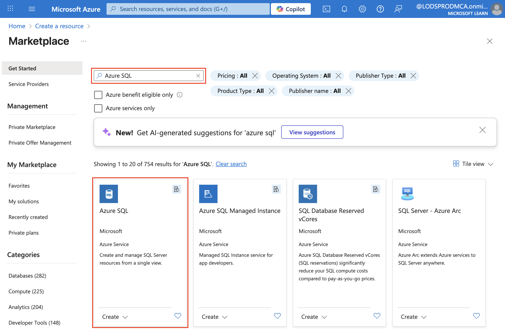

---
lab:
  title: Einführung in Azure SQL-Datenbank
  module: Explore relational data in Azure
---

# Einführung in Azure SQL-Datenbank

In dieser Übung erfahren Sie, wie Sie eine Azure SQL-Datenbank-Instanz bereitstellen und mithilfe von SQL-Abfragen damit interagieren. Sie verwenden die Microsoft AdventureWorks-Beispieldatenbank, die bereits ausgefüllte Tabellen und Daten enthält, sodass Sie sich auf das Erkunden und Abfragen relationaler Daten konzentrieren können, ohne ihr eigenes Schema erstellen oder Beispieldaten einfügen zu müssen. Dieser Ansatz sorgt für eine einfache Vorgehensweise und ermöglicht es Ihnen, sich auf das Verständnis der grundlegenden Datenbankkonzepte und SQL-Syntax zu konzentrieren.

Dieses Lab dauert ungefähr **15** Minuten.

## Vorbereitung

Sie benötigen ein [Azure-Abonnement](https://azure.microsoft.com/free), in dem Sie Administratorzugriff besitzen.

## Bereitstellen einer Azure SQL-Datenbankressource

1. Wählen Sie im [Azure-Portal](https://portal.azure.com?azure-portal=true) oben links die Option **&#65291; Ressource erstellen** aus und suchen Sie nach `Azure SQL`. Klicken Sie auf der angezeigten Seite **Azure SQL** auf **Erstellen**.

    

1. Überprüfen Sie die verfügbaren Azure SQL-Optionen. Vergewissern Sie sich, dass auf der Kachel **SQL-Datenbanken** die Option **Einzeldatenbank** ausgewählt ist, und klicken Sie auf **Erstellen**.

    

    > _**Tipp**: Eine einzelne Datenbank lässt sich für diese Übung am schnellsten und einfachsten einrichten. Bei den anderen Optionen werden Einstellungen hinzugefügt, die Sie noch nicht benötigen._

1. Geben Sie die folgenden Werte auf der Seite **SQL-Datenbank erstellen** ein, und belassen Sie alle anderen Eigenschaften in ihrer Standardeinstellung:
    - **Abonnement**: Wählen Sie Ihr Azure-Abonnement.
    - **Ressourcengruppe:** Erstellen Sie eine neue Ressourcengruppe mit einem Namen Ihrer Wahl.
    - **Datenbankname**: `AdventureWorks`
    - **Server**: Wählen Sie die Option **Neu erstellen** aus, und erstellen Sie einen neuen Server mit einem eindeutigen Namen an einem verfügbaren Standort Ihrer Wahl. Verwenden Sie die **SQL-Authentifizierung**, und geben Sie Ihren Namen als Serveradministrator und ein ausreichend komplexes Kennwort an. Notieren Sie sich das Kennwort, da sie es später benötigen.
    - **Möchten Sie einen Pool für elastische SQL-Datenbanken verwenden?**: *Nein*
    - **Workloadumgebung**: Entwicklung
    - **Compute + Speicher**: Lassen Sie den Wert unverändert.
    - **Redundanz für Sicherungsspeicher**: *Lokal redundanter Sicherungsspeicher*

    > _**Tipp**: Die SQL-Authentifizierung kann schnell für die letzten Schritte (keine zusätzlichen Schritte der Microsoft Entra ID) durchgeführt werden. Entwicklungsstandardwerte sind billiger und schnell. Eine lokale Sicherung ist die kostengünstige Wahl und für eine temporäre Übungsdatenbank gut geeignet._

1. Klicken Sie auf der Seite **SQL-Datenbank erstellen** auf **Weiter: Netzwerk >** . Klicken Sie anschließend auf der Seite **Netzwerk** im Abschnitt **Netzwerkkonnektivität** auf **Öffentlicher Endpunkt**. Wählen Sie im Abschnitt **Firewallregeln** für beide Optionen **Ja** aus, um den Zugriff auf Ihren Datenbankserver von Azure-Diensten und Ihrer aktuellen Client-IP-Adresse aus zuzulassen.

    

    > _**Tipp**: Mit öffentlichem Endpunkt und erlaubtem Zugriff auf Ihre IP-Adresse können Sie sofort eine Verbindung herstellen. Gut für eine kurze Übung. In echten Projekten schränken Sie normalerweise den Zugriff weiter ein._

1. Klicken Sie auf **Weiter: Sicherheit >** , und legen Sie für **Microsoft Defender für SQL aktivieren** die Option **Nicht jetzt** fest.

    > _**Tipp**: Defender ist ein kostenpflichtiges Sicherheits-Add-On. Wir überspringen es hier, um die Dinge einfach zu halten und die Entstehung von Kosten in einer kurzen Übung zu vermeiden._

1. Klicken Sie auf **Weiter: Zusätzliche Einstellungen >** . Legen Sie auf der Registerkarte **Zusätzliche Einstellungen** für **Vorhandene Daten verwenden** die Option **Beispiel** fest. Dadurch wird eine Beispieldatenbank erstellt, die Sie sich später ansehen können.

    > _**Tipp**: Mit Beispieldaten erhalten Sie vorgefertigte Tabellen und Zeilen, damit Sie sofort mit der Abfrage beginnen können._

1. Klicken Sie zum Erstellen Ihrer Instanz von Azure SQL-Datenbank auf **Überprüfen + erstellen** und dann auf **Erstellen**.

1. Warten Sie, bis die Bereitstellung abgeschlossen ist. Wechseln Sie anschließend zu der bereitgestellten Ressource, die wie folgt aussehen sollte:

    

1. Klicken Sie im linken Bereich auf **Abfrage-Editor (Vorschau)**. Melden Sie sich mit dem Administratornamen und dem Kennwort an, die Sie für Ihren Server angegeben haben.
    
    >**Hinweis:** Wird eine Fehlermeldung mit dem Hinweis angezeigt, dass die Client-IP-Adresse nicht zulässig ist, wählen den Link **Liste zugelassener IP-Adressen...** am Ende der Nachricht, um den Zugriff zu gewähren. Versuchen Sie dann erneut, sich anzumelden. (Sie haben zwar zuvor die Client-IP-Adresse Ihres Computers den Firewallregeln hinzugefügt, doch je nach Netzwerkkonfiguration stellt der Abfrage-Editor möglicherweise eine Verbindung von einer anderen Adresse aus her.)
    
    Der Abfrage-Editor sieht folgendermaßen aus:
    
    

1. Erweitern Sie den Ordner **Tabellen**, um die Tabellen in der Datenbank anzuzeigen.

1. Geben Sie im Bereich **Abfrage 1** den folgenden SQL-Code ein:

    ```sql
   SELECT * FROM SalesLT.Product;
    ```

    > _**Tipp**: SELECT * zeigt schnell jede Spalte und einige Werte an. (In echten Apps vermeiden Sie dies normalerweise und wählen nur die benötigten Spalten aus.)_

1. Klicken Sie oberhalb der Abfrage auf **&#9655; Ausführen**, um die Abfrage auszuführen und die Ergebnisse anzuzeigen. Diese sollten wie nachstehend gezeigt sämtliche Spalten aller Zeilen der Tabelle **SalesLT.Product** enthalten:

    

1. Ersetzen Sie die SELECT-Anweisung durch den folgenden Code, und klicken Sie dann auf **&#9655; Ausführen**, um die neue Abfrage auszuführen und die Ergebnisse anzuzeigen (diese enthalten nur die Spalten **ProductID**, **Name**, **ListPrice** und **ProductCategoryID**):

    ```sql
   SELECT ProductID, Name, ListPrice, ProductCategoryID
   FROM SalesLT.Product;
    ```

    > _**Tipp**: Wenn Sie nur die benötigten Spalten auflisten, bleiben die Ergebnisse kleiner und können schneller ausgeführt werden._

1. Führen Sie nun die folgende Abfrage aus, die mithilfe von JOIN den Kategorienamen aus der Tabelle **SalesLT.ProductCategory** abruft:

    ```sql
    SELECT 
        p.ProductID, 
        p.Name AS ProductName,
        c.Name AS Category, 
        p.ListPrice
    FROM SalesLT.Product AS p
    INNER JOIN SalesLT.ProductCategory AS c 
        ON p.ProductCategoryID = c.ProductCategoryID;
    ```

    > _**Tipp**: Die JOIN zeigt, wie verwandte Daten (der Kategoriename) mithilfe einer übereinstimmenden ID aus einer anderen Tabelle abgerufen werden._

1. Schließen Sie den Bereich des Abfrage-Editors, und verwerfen Sie Ihre Bearbeitungen.

> _**Tipp**: Wenn Sie die Erkundung von Azure SQL-Datenbank abgeschlossen haben, können Sie die in dieser Übung erstellte Ressourcengruppe löschen. Durch das Löschen der Ressourcengruppe werden alle Ressourcen in einem Schritt entfernt. Außerdem werden die Kosten minimiert._
