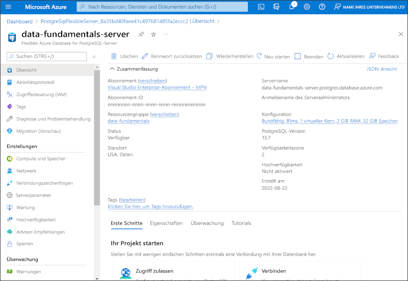

---
lab:
  title: Einführung in Azure Database for PostgreSQL
  module: Explore relational data in Azure
---

# Einführung in Azure Database for PostgreSQL

In dieser Übung stellen Sie eine Azure Database for PostgreSQL-Ressource in Ihrem Azure-Abonnement bereit.

Dieses Lab dauert ungefähr **5** Minuten.

## Vorbereitung

Sie benötigen ein [Azure-Abonnement](https://azure.microsoft.com/free), in dem Sie Administratorzugriff besitzen.

## Bereitstellen einer Azure Database for PostgreSQL-Ressource

In dieser Übung stellen Sie eine Azure Database for PostgreSQL-Ressource bereit.

1. Wählen Sie im Azure-Portal in der oberen linken Ecke die Option **&#65291; Ressource erstellen** und suchen Sie nach `Azure Database for PostgreSQL`. Klicken Sie auf der angezeigten Seite **Azure Database for PostgreSQL** auf **Erstellen**.

1. Sehen Sie sich die verfügbaren Azure Database for PostgreSQL-Optionen an, und wählen Sie dann auf der **Azure Database for PostgreSQL**-Kachel **Flexible server (Recommended)** (Flexibler Server (empfohlen)) und dann **Erstellen** aus.

    

1. Geben Sie auf der Seite **SQL-Datenbank erstellen** die folgenden Werte ein:
    - **Abonnement**: Wählen Sie Ihr Azure-Abonnement.
    - **Ressourcengruppe**: Erstellen Sie eine neue Ressourcengruppe mit einem Namen Ihrer Wahl.
    - **Servername**: Geben Sie einen eindeutigen Namen ein.
    - **Region**: Wählen Sie eine Region in Ihrer Nähe aus.
    - **PostgreSQL-Version**: Lassen Sie den Wert unverändert.
    - **Workloadtyp**: Wählen Sie **Entwicklung** aus.
    - **Compute + Speicher**: Lassen Sie den Wert unverändert.
    - **Verfügbarkeitszone**: Lassen Sie den Wert unverändert.
    - **Hochverfügbarkeit aktivieren**: Lassen Sie den Wert unverändert.
    - **Administratorbenutzername**: Geben Sie Ihren Namen ein.
    - **Kennwort** und **Kennwort bestätigen**: Geben Sie ein ausreichend komplexes Kennwort ein.

1. Klicken Sie auf **Weiter: Netzwerk**.

1. Wählen Sie unter **Firewallregeln** die Option **&#65291; Aktuelle Client-IP-Adresse hinzufügen** aus.

1. Klicken Sie zum Erstellen Ihrer PostgreSQL-Datenbank von Azure auf **Überprüfen + erstellen** und dann auf **Erstellen**.

1. Warten Sie, bis die Bereitstellung abgeschlossen ist. Wechseln Sie anschließend zu der bereitgestellten Ressource, die wie folgt aussehen sollte:

    

1. Überprüfen Sie die Optionen zur Verwaltung Ihrer Azure Database for PostgreSQL-Ressource.

> **Tipp**: Wenn Sie die Erkundung von Azure Database for PostgreSQL abgeschlossen haben, können Sie die in dieser Übung erstellte Ressourcengruppe löschen.
