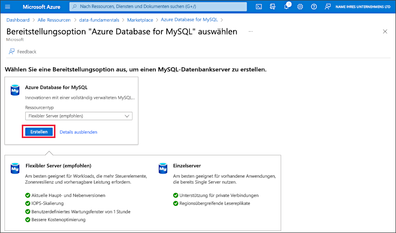

---
lab:
  title: Einführung in Azure Database for MySQL
  module: Explore relational data in Azure
---

# Einführung in Azure Database for MySQL

In dieser Übung stellen Sie eine Azure Database for MySQL-Ressource in Ihrem Azure-Abonnement bereit.

Dieses Lab dauert ungefähr **5** Minuten.

## Vorbereitung

Sie benötigen ein [Azure-Abonnement](https://azure.microsoft.com/free), in dem Sie Administratorzugriff besitzen.

## Bereitstellen einer Azure Database for MySQL-Ressource

In dieser Übung stellen Sie eine Azure Database for MySQL-Ressource bereit.

1. In the Azure portal, select <bpt id="p1">**</bpt>&amp;#65291; Create a resource<ept id="p1">**</ept> from the upper left-hand corner and search for <bpt id="p2">*</bpt>Azure Database for MySQL<ept id="p2">*</ept>. Then in the resulting <bpt id="p1">**</bpt>Azure Database for MySQL<ept id="p1">**</ept> page, select <bpt id="p2">**</bpt>Create<ept id="p2">**</ept>.

1. Review the Azure Database for MySQL options that are available. Then for <bpt id="p1">**</bpt>Resource type<ept id="p1">**</ept>, select <bpt id="p2">**</bpt>Flexible Server<ept id="p2">**</ept> and select <bpt id="p3">**</bpt>Create<ept id="p3">**</ept>.

    

1. Geben Sie auf der Seite **SQL-Datenbank erstellen** die folgenden Werte ein:
    - **Abonnement**: Wählen Sie Ihr Azure-Abonnement.
    - **Ressourcengruppe**: Erstellen Sie eine neue Ressourcengruppe mit einem Namen Ihrer Wahl.
    - **Servername**: Geben Sie einen eindeutigen Namen ein.
    - **Region**: Ein beliebiger verfügbarer Standort in Ihrer Nähe.
    - **MySQL-Version**: Lassen Sie den Wert unverändert.
    - **Workloadtyp**: Für Entwicklungs- oder Hobbyprojekte.
    - **Compute + Speicher**: Lassen Sie den Wert unverändert.
    - **Verfügbarkeitszone**: Lassen Sie den Wert unverändert.
    - **Hochverfügbarkeit aktivieren**: Lassen Sie den Wert unverändert.
    - **Benutzername des Administrators**: Geben Sie Ihren Namen ein.
    - **Kennwort** und **Kennwort bestätigen**: Geben Sie ein ausreichend komplexes Kennwort ein.

1. Klicken Sie auf **Weiter: Netzwerk**.

1. Wählen Sie unter **Firewallregeln** die Option **&#65291; Aktuelle Client-IP-Adresse hinzufügen** aus.

1. Klicken Sie zum Erstellen Ihrer Instanz von Azure-MySQL-Datenbank auf **Überprüfen + erstellen** und dann auf **Erstellen**.

1. Wait for deployment to complete. Then go to the resource that was deployed, which should look like this:

    

1. Überprüfen Sie die Optionen zur Verwaltung Ihrer Azure Database for MySQL-Ressource.

> **Tipp**: Wenn Sie die Erkundung von Azure Database for MySQL abgeschlossen haben, können Sie die in dieser Übung erstellte Ressourcengruppe löschen.
