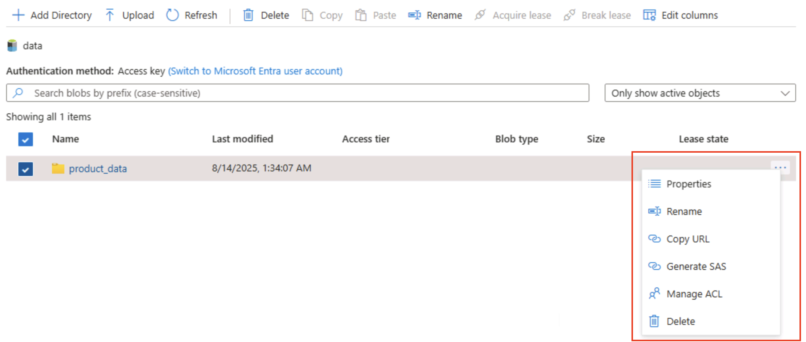

---
lab:
  title: Erkunden von Azure Storage
  module: Explore Azure Storage for non-relational data
---

# Erkunden von Azure Storage

In dieser Übung erfahren Sie, wie Sie ein Azure Storage-Konto bereitstellen und konfigurieren, und lernen dessen wichtigsten Dienste kennen: Blob Storage, Data Lake Storage Gen2, Azure Files und Azure Tables. Lernen Sie, wie Sie Container erstellen, Daten hochladen, hierarchische Namespaces aktivieren, Dateifreigaben einrichten und Tabellenentitäten verwalten. Diese Fähigkeiten helfen Ihnen zu verstehen, wie sie nicht relationale Daten in Azure für verschiedene Analyse- und Anwendungsszenarien speichern, organisieren und sichern.

Dieses Lab dauert ungefähr **15** Minuten.

> _**Tipp**: Wenn Sie den Zweck jeder Aktion verstehen, können Sie später Speicherlösungen entwerfen, die Kosten, Leistung, Sicherheit und Analyseziele ausgleichen. Diese kurzen Warum-Hinweise verknüpfen jeden Schritt mit einem praktischen Grund._

## Vor der Installation

Sie benötigen ein [Azure-Abonnement](https://azure.microsoft.com/free), in dem Sie Administratorzugriff besitzen.

## Bereitstellen eines Azure Storage-Kontos

Der erste Schritt bei der Verwendung von Azure Storage ist die Bereitstellung eines Azure Storage-Kontos in Ihrem Azure-Abonnement.

> _**Tipp**: Ein Speicherkonto ist die sichere, abrechnende Grenze für alle Azure Storage-Dienste (Blobs, Dateien, Warteschlangen, Tabellen). Richtlinien, Redundanz, Verschlüsselung, Netzwerk und Zugriffssteuerung gelten ab hier für alle darunterliegenden Ebenen._

1. Melden Sie sich beim [Azure-Portal](https://portal.azure.com?azure-portal=true) an, falls Sie dies noch nicht getan haben.

1. Wählen Sie auf der Startseite des Azure-Portals in der oberen linken Ecke die Option **&#65291; Ressource erstellen** und suchen Sie nach `Storage account`. Wählen Sie dann auf der resultierenden Seite **Speicherkonto** die Option **Erstellen** aus.

    

1. Geben Sie auf der Seite **Erstellen eines Speicherkontos** die folgenden Werte ein:
   
    - **Abonnement**: Wählen Sie Ihr Azure-Abonnement.
    - **Ressourcengruppe:** Erstellen Sie eine neue Ressourcengruppe mit einem Namen Ihrer Wahl.
    - **Speicherkontoname**: Geben Sie einen eindeutigen Namen für Ihr Speicherkonto mit Kleinbuchstaben und Zahlen ein.
    - **Region**: Wählen Sie einen beliebigen verfügbaren Standort aus.
    - **Leistung**: *Standard*
    - **Redundanz**: *Lokal redundanter Speicher (LRS)*

    

    > _**Tipp**: Eine neue Ressourcengruppe erleichtert die Bereinigung. Standard und LRS ist der Basisplan der niedrigsten Kosten, der für Lernen gut geeignet ist. LRS hält drei synchrone Kopien in einer Region, die für nicht kritische Demodaten geeignet sind, ohne für die Georeplikation zu bezahlen._

1. Wählen Sie **Weiter: Erweitert >** aus, und zeigen Sie die Optionen der erweiterten Konfiguration an. Beachten Sie insbesondere, dass Sie hier den hierarchischen Namespace aktivieren können, um Azure Data Lake Storage Gen2 zu unterstützen. Lassen Sie diese Option **<u>deaktivierten</u>** (Sie aktivieren sie später), und wählen Sie dann **Weiter: Netzwerk >** aus, um die Netzwerkoptionen für Ihr Speicherkonto anzuzeigen.
   
   

1. Wählen Sie **Weiter: Datenschutz >** aus, und <u>deaktivieren</u> Sie dann im Abschnitt **Wiederherstellung** alle Optionen unter **Vorläufiges Löschen aktivieren**. Diese Optionen behalten gelöschte Dateien für die nachfolgende Wiederherstellung bei, können aber später Probleme verursachen, wenn Sie den hierarchischen Namespace aktivieren.

    

1. Fahren Sie mit den verbleibenden Seiten **Weiter >** fort, ohne die Standardeinstellungen zu ändern. Warten Sie dann auf der Seite **Überprüfen**, bis Ihre Auswahl überprüft wurde, und wählen Sie **Erstellen** aus, um Ihr Azure Storage-Konto zu erstellen.

1. Warten Sie, bis die Bereitstellung abgeschlossen ist. Wechseln Sie dann zu der Ressource, die bereitgestellt wurde.

## Erkunden von Blobspeicher

Nachdem Sie nun über ein Azure Storage-Konto verfügen, können Sie einen Container für Blobdaten erstellen.

> _**Tipp**: Ein Container gruppiert Blobs und ist die erste Bereichsebene für die Zugriffssteuerung. Wenn Sie mit einfachem Blobspeicher starten (ohne hierarchischen Namespace), sehen Sie ein virtuelles Ordnerverhalten, das Sie später mit Data Lake Gen2 vergleichen können._

1. Laden Sie die JSON-Datei [product1.json](https://aka.ms/product1.json?azure-portal=true) von `https://aka.ms/product1.json` herunter, und speichern Sie sie auf Ihrem Computer (Sie können sie in einem beliebigen Ordner speichern. Später laden Sie sie in Blobspeicher hoch).

    *Wenn die JSON-Datei in Ihrem Browser angezeigt wird, klicken Sie mit der rechten Maustaste auf die Seite, und wählen Sie **Speichern unter** aus. Benennen Sie die Datei **product1.json**, und speichern Sie sie in Ihrem Ordner „Downloads“.* 

2. Wählen Sie auf der Azure-Portalseite für Ihren Speichercontainer auf der linken Seite im Abschnitt **Datenspeicher** die Option **Container** aus.
   
    

3. Wählen Sie auf der Seite **Container** die Option **&#65291; Container hinzufügen** aus und fügen Sie einen neuen Container mit dem Namen `data` und der anonymen Zugriffsebene **Privat (kein anonymer Zugriff)** hinzu.

    

    > _**Tipp**: Bei privatem Zugriff bleiben Ihre Beispieldaten sicher. Der öffentliche Zugriff ist nur selten erforderlich, außer bei statischen Website- oder offenen Datenszenarien. Wenn Sie dem Beispiel den Namen `data` geben, bleibt es einfach und lesbar._

4. Wenn der Container **data** erstellt wurde, überprüfen Sie, ob er auf der Seite **Container** aufgeführt ist.

5. Wählen Sie im Bereich auf der linken Seite im oberen Abschnitt **Speicherbrowser** aus. Diese Seite enthält eine browserbasierte Benutzeroberfläche, mit der Sie mit den Daten in Ihrem Speicherkonto arbeiten können.

6. Wählen Sie auf der Seite des Speicherbrowsers **Blobcontainer** aus, und überprüfen Sie, ob Ihr Container **data** aufgeführt ist.

7. Wählen Sie den Container **data** aus, und beachten Sie, dass er leer ist.

    

8. Wählen Sie **&#65291; Verzeichnis hinzufügen** und lesen Sie die Informationen zu Ordnern, bevor Sie einen neuen Ordner mit dem Namen `products` erstellen.

9. Überprüfen Sie im Speicherbrowser, ob in der aktuellen Ansicht der Inhalt des soeben erstellten Ordners **products** angezeigt wird. Beachten Sie, dass die „Breadcrumbs“ oben auf der Seite den Pfad **Blobcontainer > data > products** widerspiegeln.

    

10. Wählen Sie in den Breadcrumbs **Daten** aus, um zum Container **data** zu wechseln, und beachten Sie, dass er <u>keinen</u> Ordner namens **products** enthält.

    Ordner im Blobspeicher sind virtuell und nur als Teil des Pfads eines Blobs vorhanden. Da der Ordner **products** keine Blobs enthielt, ist er nicht wirklich vorhanden!

    > _**Tipp**: Der flache Namespace bedeutet, dass Verzeichnisse nur Namenspräfixe (Produkte/file.json) sind. Dieses Design ermöglicht eine massive Skalierung, da der Dienst Blobnamen indiziert, anstatt eine echte Baumstruktur beizubehalten._

11. Verwenden Sie die Schaltfläche **&#10514; Hochladen**, um den Bereich **Blob hochladen** zu öffnen.

12. Wählen Sie im Bereich **Blob hochladen** die Datei **product1.json** aus, die Sie zuvor auf Ihrem lokalen Computer gespeichert haben. Geben Sie anschließend im Abschnitt **Erweitert** im Feld **In Ordner hochladen** den Wert `product_data` ein und wählen Sie die Schaltfläche **Hochladen**.

    

    > _**Tipp**: Durch das Angeben eines Ordnernamens beim Hochladen wird automatisch der virtuelle Pfad erstellt. Dies zeigt, dass durch das Vorhandensein eines Blobs der „Ordner“ angezeigt wird._

13. Schließen Sie den Bereich **Blob hochladen**, wenn er noch geöffnet ist, und überprüfen Sie, ob ein virtueller Ordner **product_data** im Container **data** erstellt wurde.

14. Wählen Sie den Ordner **product_data** aus, und vergewissern Sie sich, dass er das hochgeladene Blob **product1.json** enthält.

15. Wählen Sie auf der linken Seite im Abschnitt **Datenspeicher** die Option **Container** aus.

16. Öffnen Sie den Container **data**, und überprüfen Sie, ob der Ordner **product_data** aufgeführt ist, den Sie erstellt haben.

17. Wählen Sie am rechten Ende des Ordners das Symbol **&#x2027;&#x2027;&#x2027;** aus, und beachten Sie, dass im Menü nicht alle Optionen angezeigt werden. Ordner in einem flachen Namespaceblobcontainer sind virtuell und können nicht verwaltet werden.

    

    > _**Tipp**: Es ist kein echtes Verzeichnisobjekt vorhanden, daher gibt es keine Umbenennungs-/Berechtigungsvorgänge – diese erfordern einen hierarchischen Namespace._

18. Verwenden Sie das Symbol **X** oben rechts auf der Seite **data**, um die Seite zu schließen und zur Seite **Container** zurückzukehren.

## Erkunden von Azure Data Lake Storage Gen2

Mit der Azure Data Lake Store Gen2-Unterstützung können Sie hierarchische Ordner verwenden, um den Zugriff auf Blobs zu organisieren und zu verwalten. Außerdem können Sie mit Azure Blob Storage verteilte Dateisysteme für gängige Big Data-Analyseplattformen hosten.

> _**Tipp**: Wenn Sie den hierarchischen Namespace aktivieren, verhalten sich Ordner wie echte Verzeichnisse. Außerdem können Sie Ordneraktionen sicher (alle gleichzeitig, ohne Fehler) ausführen und Steuerelemente für Dateiberechtigungen wie in Linux verwenden. Dies ist besonders beim Arbeiten mit Big Data-Tools wie Spark oder Hadoop hilfreich oder beim Verwalten großer, organisierter Data Lakes._

1. Laden Sie die JSON-Datei [product2.json](https://aka.ms/product2.json?azure-portal=true) von `https://aka.ms/product2.json` herunter und speichern Sie sie auf Ihrem Computer in demselben Ordner, in dem Sie zuvor **product1.json** heruntergeladen haben. Sie laden sie später in Blob Storage hoch.

1. Scrollen Sie im Azure-Portal auf der Seite Ihres Speicherkontos links nach unten zum Abschnitt **Einstellungen**, und wählen Sie **Data Lake Gen2-Upgrade** aus.

    

1. Erweitern Sie die einzelnen Schritte auf der Seite **Data Lake Gen2-Upgrade**, und führen Sie sie aus, um ein Upgrade Ihres Speicherkontos durchzuführen. So aktivieren Sie den hierarchischen Namespace und unterstützen Azure Data Lake Storage Gen 2. Dieser Vorgang kann einige Zeit dauern.

    

    > _**Tipp**: Das Upgrade ist ein Funktionswechsel auf Kontoebene – Daten bleiben bestehen, doch die Verzeichnissemantik wird geändert, um erweiterte Vorgänge zu unterstützen._

1. Wenn das Upgrade abgeschlossen ist, wählen Sie im Bereich auf der linken Seite im oberen Abschnitt **Speicherbrowser** aus, und navigieren Sie zurück zum Stamm Ihres Blobcontainers **data**, der weiterhin den Ordner **product_data** enthält.

1. Wählen Sie den Ordner **product_data** aus, und vergewissern Sie sich, dass er noch die Datei **product1.json** enthält, die Sie zuvor hochgeladen haben.

1. Verwenden Sie die Schaltfläche **&#10514; Hochladen**, um den Bereich **Blob hochladen** zu öffnen.

1. Wählen Sie im Bereich **Blob hochladen** die Datei **product2.json** aus, die Sie auf Ihrem lokalen Computer gespeichert haben. Wählen Sie dann die Schaltfläche **Hochladen** aus.

1. Schließen Sie den Bereich **Blob hochladen**, wenn er noch geöffnet ist, und überprüfen Sie, ob ein Ordner **product_data** jetzt die Datei **product2.json** enthält.

    

    > _**Tipp**: Das Hinzufügen einer zweiten Datei nach dem Upgrade bestätigt die nahtlose Kontinuität: Vorhandene Blobs funktionieren weiterhin, und neue profitieren von hierarchischen Vorteilen wie Verzeichnis-ACLs (Zugriffssteuerungslisten)._

1. Wählen Sie auf der linken Seite im Abschnitt **Datenspeicher** die Option **Container** aus.

1. Öffnen Sie den Container **data**, und überprüfen Sie, ob der Ordner **product_data** aufgeführt ist, den Sie erstellt haben.

1. Wählen Sie das Symbol **&#x2027;&#x2027;&#x2027;** am rechten Ende des Ordners aus, und beachten Sie, dass Sie Konfigurationsaufgaben wie das Umbenennen von Ordnern und das Festlegen von Berechtigungen auf Ordnerebene ausführen können, wenn der hierarchische Namespace aktiviert ist.

    

    > _**Tipp**: Echte Ordner ermöglichen es, Sicherheitsrichtlinien nach dem Least-Privilege-Prinzip auf Ordnerebene anzuwenden. Sie sorgen für sicheres Umbenennen und beschleunigen rekursive Auflistungen im Vergleich zum Scannen von Tausenden von Blobnamen mit Präfixen._

1. Verwenden Sie das Symbol **X** oben rechts auf der Seite **data**, um die Seite zu schließen und zur Seite **Container** zurückzukehren.

## Erkunden von Azure Files

Azure Files bietet eine Möglichkeit, cloudbasierte Dateifreigaben zu erstellen.

> _**Tipp**: Azure Files bietet SMB/NFS-Endpunkte für Lift-and-Shift-Szenarien, in denen Apps ein herkömmliches Dateisystem erwarten. Es ergänzt (nicht ersetzt) Blobspeicher, indem Dateisperren und betriebssystemeigene Tools unterstützt werden._

1. Wählen Sie auf der Azure-Portalseite für Ihren Speichercontainer auf der linken Seite im Abschnitt **Datenspeicher** die Option **Dateifreigaben** aus.

    

1. Wählen Sie auf der Seite „Dateifreigaben“ die Option **&#65291; Dateifreigabe** aus und fügen Sie eine neue Dateifreigabe mit dem Namen `files` unter Verwendung der Stufe **Transaktionsoptimiert** hinzu.

1. Wählen Sie **Weiter: Backup >** und deaktivieren Sie das Backup. Wählen Sie dann **Überprüfen + erstellen** aus.

    

    > _**Tipp**:  Durch das Deaktivieren der Sicherung bleiben die Kosten für kurz genutzte Übungsumgebung gering. Sie würden diese Option für die Ausfallsicherheit in der Produktionsumgebung aktivieren._

1. Öffnen Sie ihre neue Freigabe **files** in den **Dateifreigaben**.

1. Wählen Sie oben auf der Seite **Verbinden** aus. Beachten Sie dann, dass der Bereich **Verbinden** Registerkarten für gängige Betriebssysteme (Windows, Linux und macOS) enthält, die Skripts enthalten, die Sie ausführen können, um von einem Clientcomputer aus eine Verbindung mit dem freigegebenen Ordner herzustellen.

    

    > _**Tipp**: Die generierten Skripts zeigen genau, wie Sie die Freigabe mithilfe von plattformeigenen Befehlen einbinden und veranschaulichen so Hybridzugriffsmuster von virtuellen Computern, Containern oder lokalen Servern._

1. Schließen Sie den Bereich **Verbinden** und dann die Seite **files**, um zur Seite **Dateifreigaben** für Ihr Azure-Speicherkonto zurückzukehren.

## Erkunden von Azure Tables

Azure Tables bietet einen Schlüssel-Wert-Speicher für Anwendungen, die Datenwerte speichern müssen, aber nicht die vollständige Funktionalität und Struktur einer relationalen Datenbank benötigen.

> _**Tipp**: Bei Tabellenspeichern handelt es sich um umfangreiche Abfragen und Verknüpfungen zu extrem niedrigen Kosten, für schemalose Flexibilität und für horizontale Skalierung – ideal für Protokolle, IoT-Daten oder Benutzerprofile._

1. Wählen Sie auf der Azure-Portalseite für Ihren Speichercontainer auf der linken Seite im Abschnitt **Datenspeicher** die Option **Tabellen** aus.

    

1. Wählen Sie auf der Seite **Tabellen** die Option **&#65291; Tabelle** und erstellen Sie eine neue Tabelle mit dem Namen `products`.

1. Nachdem die Tabelle **products** erstellt wurde, wählen Sie im Bereich auf der linken Seite im oberen Abschnitt **Speicherbrowser** aus.

1. Wählen Sie im Speicher-Explorer **Tabellen** aus, und überprüfen Sie, ob die Tabelle **products** aufgeführt ist.

1. Wählen Sie die Tabelle **products** aus.

1. Wählen Sie auf der Seite **product** die Option **&#65291; Entität hinzufügen** aus.

1. Geben Sie im Bereich **Entität hinzufügen** die folgenden Schlüsselwerte ein:
    - **PartitionKey**: 1
    - **RowKey**: 1

    > _**Tipp**: PartitionKey gruppiert verwandte Entitäten zum Verteilen der Last; RowKey identifiziert eindeutig innerhalb der Partition. Zusammen bilden sie einen schnellen zusammengesetzten Primärschlüssel für Nachschlagevorgänge._

1. Wählen Sie **Eigenschaft hinzufügen** aus, und erstellen Sie zwei neue Eigenschaften mit den folgenden Werten:

    |Eigenschaftenname | type | Wert |
    | ------------ | ---- | ----- |
    | Name | String | Widget |
    | Preis | Double | 2,99 |

    

1. Wählen Sie **Einfügen** aus, um eine Zeile für die neue Entität in die Tabelle einzufügen.

1. Überprüfen Sie im Speicherbrowser, ob der Tabelle **products** eine Zeile hinzugefügt wurde, und ob eine Spalte **Zeitstempel** erstellt wurde, um anzugeben, wann die Zeile zuletzt geändert wurde.

1. Fügen Sie der Tabelle **products** eine weitere Entität mit den folgenden Eigenschaften hinzu:

    |Eigenschaftenname | type | Wert |
    | ------------ | ---- | ----- |
    | PartitionKey | String | 1 |
    | RowKey | String | 2 |
    | Name | String | Kniknak |
    | Preis | Double | 1.99 |
    | Eingestellt | Boolean | true |

    > _**Tipp**: Das Hinzufügen einer zweiten Entität mit unterschiedlichen Schlüsseln und eine zusätzliche boolesche Eigenschaft veranschaulicht die Flexibilität beim Schreiben von Schemas – neue Attribute erfordern keine Migration._

1. Überprüfen Sie nach dem Einfügen der neuen Entität, ob eine Zeile mit dem eingestellten Produkt in der Tabelle angezeigt wird.

    Sie haben über die Benutzeroberfläche des Speicherbrowsers manuell Daten in die Tabelle eingegeben. In einem realen Szenario können Anwendungsentwickler die Azure Storage-Tabellen-API verwenden, um Anwendungen zu erstellen, die Werte aus Tabellen lesen und dort hineinschreiben, sodass sie kostengünstige und skalierbare Lösung für NoSQL-Speicher sind.

> _**Tipp**: Wenn Sie die Erkundung von Azure Storage abgeschlossen haben, können Sie die in dieser Übung erstellte Ressourcengruppe löschen. Das Löschen der Ressourcengruppe ist die einfachste Möglichkeit, fortlaufende Gebühren zu vermeiden. Entfernen Sie dazu jede Ressource, die Sie in einer Aktion erstellt haben._
