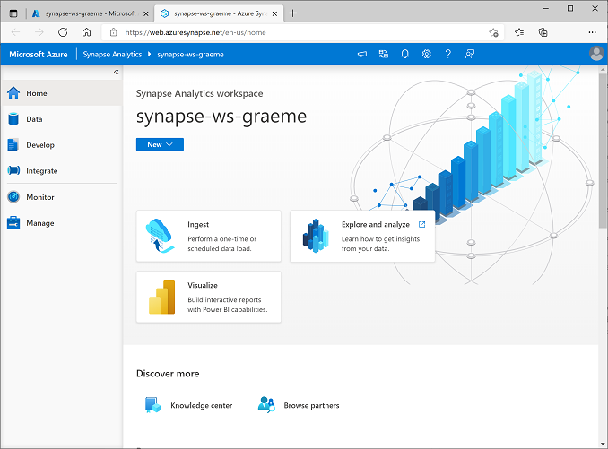

---
lab:
  title: Erkunden von Datenanalysen in Azure mit Azure Synapse Analytics
  module: Explore fundamentals of large-scale data warehousing
---

# <a name="explore-data-analytics-in-azure-with-azure-synapse-analytics"></a>Erkunden von Datenanalysen in Azure mit Azure Synapse Analytics

In dieser Übung stellen Sie einen Azure Synapse Analytics-Arbeitsbereich in Ihrem Azure-Abonnement bereit und verwenden ihn zum Erfassen und Abfragen von Daten.

Dieses Lab dauert ungefähr **30** Minuten.

## <a name="before-you-start"></a>Vorbereitung

Sie benötigen ein [Azure-Abonnement](https://azure.microsoft.com/free), in dem Sie Administratorzugriff besitzen.

## <a name="provision-an-azure-synapse-analytics-workspace"></a>Bereitstellen eines Azure Synapse Analytics-Arbeitsbereichs

Damit Sie Azure Synapse Analytics verwenden können, müssen Sie eine Azure Synapse Analytics-Arbeitsbereichsressource in Ihrem Azure-Abonnement bereitstellen.

1. Öffnen Sie das Azure-Portal unter [https://portal.azure.com](https://portal.azure.com?azure-portal=true), und melden Sie sich mit den Anmeldeinformationen für Ihr Azure-Abonnement an.

    > <bpt id="p1">**</bpt>Tip<ept id="p1">**</ept>:  Ensure you are working in the directory containing your subscription - indicated at the top right under your user ID. If not, select the user icon and switch directory.

2. Verwenden Sie das Symbol **&#65291; Ressource erstellen** auf der **Startseite** des Azure-Portals, um eine neue Ressource zu erstellen.
3. Suchen Sie nach *Azure Synapse Analytics*, und erstellen Sie eine neue **Azure Synapse Analytics-Ressource** mit den folgenden Einstellungen:
    - **Abonnement:** *Geben Sie Ihr Azure-Abonnement an.*
        - **Ressourcengruppe**: *Erstellen Sie eine neue Ressourcengruppe mit einem geeigneten Namen wie „synapse-rg“.*
        - **Verwaltete Ressourcengruppe**: *Geben Sie einen geeigneten Namen ein, z. B. „synapse-managed-rg“.*
    - **Arbeitsbereichsname**: *Geben Sie einen eindeutigen Arbeitsbereichsnamen ein, z. B. „synapse-ws-<Ihr_Name>“* .
    - **Region:***Wählen Sie eine der folgenden Regionen aus:*
        - Australien (Osten)
        - USA (Mitte)
        - USA (Ost) 2
        - Nordeuropa
        - USA Süd Mitte
        - Asien, Südosten
        - UK, Süden
        - Europa, Westen
        - USA (Westen)
        - USA, Westen 2
    - **Data Lake Storage Gen 2 auswählen**: Aus Abonnement
        - **Kontoname**: *Erstellen Sie ein neues Konto mit einem eindeutigen Namen, z. B. „datalake<Ihr_Name>“.*
        - **Dateisystemname**: *Erstellen Sie ein neues Dateisystem mit einem eindeutigen Namen, z. B. „fs<Ihr_Name>“.*

    > <bpt id="p1">**</bpt>Note<ept id="p1">**</ept>: A Synapse Analytics workspace requires two resource groups in your Azure subscription; one for resources you explicitly create, and another for managed resources used by the service. It also requires a Data Lake storage account in which to store data, scripts, and other artifacts.

4. Wenn Sie diese Details eingegeben haben, klicken Sie auf **Überprüfen + Erstellen** und dann auf **Erstellen**, um den Arbeitsbereich zu erstellen.
5. Warten Sie, bis der Arbeitsbereich erstellt wurde. Dies kann etwa fünf Minuten dauern.
6. Wenn die Bereitstellung abgeschlossen ist, wechseln Sie zur erstellten Ressourcengruppe, und überprüfen Sie, ob sie Ihren Synapse Analytics-Arbeitsbereich und ein Data Lake-Speicherkonto enthält.
7. Wählen Sie Ihren Synapse-Arbeitsbereich aus, und klicken Sie auf der Seite **Übersicht** der Karte **Synapse Studio öffnen** auf die Option **Öffnen**, um Synapse Studio auf einer neuen Browserregisterkarte zu öffnen. Synapse Studio ist eine webbasierte Schnittstelle, die Sie zum Arbeiten mit Ihrem Synapse Analytics-Arbeitsbereich verwenden können.
8. Verwenden Sie auf der linken Seite von Synapse Studio das Symbol **&rsaquo;&rsaquo;**, um das Menü zu erweitern. Dadurch werden die verschiedenen Seiten in Synapse Studio angezeigt, die Sie zum Verwalten von Ressourcen und zum Ausführen von Datenanalyseaufgaben verwenden, wie im Folgenden gezeigt:

    

## <a name="ingest-data"></a>Erfassen von Daten

Eine der wichtigsten Aufgaben, die Sie mit Azure Synapse Analytics ausführen können, ist das Definieren von *Pipelines*, die Daten aus einer Vielzahl von Quellen zur Analyse in Ihren Arbeitsbereich übertragen (und bei Bedarf transformieren).

1. Wählen Sie in Synapse Studio auf der **Homepage** die Option **Erfassen** und dann **Integrierter Kopiertask** aus, um das Tool **Daten kopieren** zu öffnen.
2. Stellen Sie im Tool „Daten kopieren “im Schritt **Eigenschaften** sicher, dass die Optionen **Integrierte Kopieraufgabe** und **Jetzt einmal ausführen** ausgewählt sind, und klicken Sie auf **Weiter >**.
3. Wählen Sie im Schritt **Quelle** im Teilschritt **Dataset** die folgenden Einstellungen aus:
    - **Quelltyp**: Alle
    - **Verbindung**: *Erstellen Sie eine neue Verbindung, und wählen Sie im Fenster **Verknüpfter Dienst** auf der Registerkarte **Datei** die Option **HTTP** aus. Erstellen Sie dann unter Verwendung der folgenden Einstellungen eine Verbindung mit einer Datendatei:*
        - **Name**: AdventureWorks-Produkte
        - **Beschreibung**: Produktliste über HTTP
        - **Verbindung über Integration Runtime herstellen**: AutoResolveIntegrationRuntime
        - **Basis-URL**: `https://raw.githubusercontent.com/MicrosoftLearning/DP-900T00A-Azure-Data-Fundamentals/master/Azure-Synapse/products.csv`
        - **Überprüfung des Serverzertifikats**: Aktivieren
        - **Authentifizierungstyp**: Anonym
4. Stellen Sie nach dem Erstellen der Verbindung sicher, dass im Teilschritt **Quelle/Dataset** die folgenden Einstellungen ausgewählt sind, und klicken Sie dann auf **Weiter >**:
    - **Relative URL**: *Nicht ausfüllen*
    - **Anforderungsmethode:** GET
    - **Zusätzliche Kopfzeilen**: *Nicht ausfüllen*
    - **Binärkopie**: <u>Nicht</u> ausgewählt
    - **Anforderungstimeout**: *Nicht ausfüllen*
    - **Maximal zulässige Anzahl paralleler Verbindungen**: *Nicht ausfüllen*
5. Wählen Sie im Schritt **Quelle** im Teilschritt **Konfiguration** die Option **Vorschaudaten** aus, um eine Vorschau der von Ihrer Pipeline erfassten Produktdaten anzuzeigen, und schließen Sie dann die Vorschau.
6. Stellen Sie nach dem Anzeigen der Datenvorschau sicher, dass im Teilschritt **Quelle/Konfiguration** die folgenden Einstellungen ausgewählt sind, und klicken Sie dann auf **Weiter >**:
    - **Dateiformat**: DelimitedText
    - **Spaltentrennzeichen**: Komma (,)
    - **Zeilen-Trennzeichen**: Zeilenvorschub (\n)
    - **Erste Zeile ist Überschrift**: Ausgewählt
    - **Komprimierungstyp**: Keiner
7. Wählen Sie im Schritt **Ziel** im Teilschritt **Dataset** die folgenden Einstellungen aus:
    - **Zieltyp**: Azure Data Lake Storage Gen 2
    - **Verbindung**: *Wählen Sie die vorhandene Verbindung mit Ihrem Data Lake-Speicher aus (diese wurde bei der Erstellung des Arbeitsbereichs für Sie erstellt).*
8. Stellen Sie nach Auswahl der Verbindung sicher, dass im Schritt **Ziel/Dataset** die folgenden Einstellungen ausgewählt sind, und klicken Sie dann auf **Weiter >** :
    - **Ordnerpfad**: *Navigieren Sie zum Ihrem Dateisystemordner.*
    - **Dateiname**: products.csv
    - **Kopierverhalten**: Keins
    - **Maximal zulässige Anzahl paralleler Verbindungen**: *Nicht ausfüllen*
    - **Blockgröße (MB)**: *Nicht ausfüllen*
9. On the <bpt id="p1">**</bpt>Target<ept id="p1">**</ept> step, in the <bpt id="p2">**</bpt>Configuration<ept id="p2">**</ept> substep, ensure that the following properties are selected. Then select <bpt id="p1">**</bpt>Next &gt;<ept id="p1">**</ept>:
    - **Dateiformat**: DelimitedText
    - **Spaltentrennzeichen**: Komma (,)
    - **Zeilen-Trennzeichen**: Zeilenvorschub (\n)
    - **Header zu Datei hinzufügen**: Ausgewählt
    - **Komprimierungstyp**: Keiner
    - **Maximale Zeilenanzahl pro Datei**: *Nicht ausfüllen*
    - **Dateinamenpräfix**: *Nicht ausfüllen*
10. Konfigurieren Sie im Schritt **Einstellungen** die folgenden Einstellungen, und klicken Sie dann auf **Weiter >**.
    - **Aufgabenname**: Kopieren von Produkten
    - **Aufgabenbeschreibung**: Kopieren von Produktdaten
    - **Fehlertoleranz **: *Nicht ausfüllen*
    - **Protokollierung aktivieren**: <u>Nicht</u> ausgewählt
    - **Staging aktivieren**: <u>Nicht</u> ausgewählt
11. Lesen Sie im Schritt **Überprüfen und fertig stellen** im Teilschritt **Überprüfen** die Zusammenfassung, und klicken Sie dann auf **Weiter >**.
12. Warten Sie im Schritt **Bereitstellung**, bis die Pipeline bereitgestellt wurde, und klicken Sie dann auf **Fertig stellen**.
13. Wählen Sie in Synapse Studio die Seite **Überwachen** aus, und warten Sie, bis auf der Registerkarte **Pipelineausführung** die Pipeline **Produkte kopieren** mit dem Status **Erfolgreich** ausgeführt wurde. (Über die Schaltfläche **&#8635; Aktualisieren** auf der Seite „Pipelineausführung“ können Sie den Status aktualisieren.)
14. On the <bpt id="p1">**</bpt>Data<ept id="p1">**</ept> page, select the <bpt id="p2">**</bpt>Linked<ept id="p2">**</ept> tab and expand the <bpt id="p3">**</bpt>Azure Data Lake Storage Gen 2<ept id="p3">**</ept> hierarchy until you see the file storage for your Synapse workspace. Then select the file storage to verify that a file named <bpt id="p1">**</bpt>products.csv<ept id="p1">**</ept> has been copied to this location, as shown here:

    

## <a name="use-a-sql-pool-to-analyze-data"></a>Verwenden eines SQL-Pools zum Analysieren von Daten

Now that you've ingested some data into your workspace, you can use Synapse Analytics to query and analyze it. One of the most common ways to query data is to use SQL, and in Synapse Analytics you can use a <bpt id="p1">*</bpt>SQL pool<ept id="p1">*</ept> to run SQL code.

1. Klicken Sie in Synapse Studio mit der rechten Maustaste auf die **products.csv**-Datei im Dateispeicher Ihres Synapse-Arbeitsbereichs, zeigen Sie auf **Neues SQL-Skript**, und wählen Sie **Die ersten 100 Zeilen auswählen** aus.
2. Überprüfen Sie im geöffneten Bereich **SQL-Skript 1** den generierten SQL Code, der in etwa wie der folgende lauten sollte:

    ```SQL
    -- This is auto-generated code
    SELECT
        TOP 100 *
    FROM
        OPENROWSET(
            BULK 'https://datalakexx.dfs.core.windows.net/fsxx/products.csv',
            FORMAT = 'CSV',
            PARSER_VERSION='2.0'
        ) AS [result]
    ```

    Dieser Code öffnet ein Rowset aus der importierten Textdatei und ruft die ersten 100 Datenzeilen ab.

3. Vergewissern Sie sich, dass in der Liste **Verbinden mit** die Option **Integriert** ausgewählt ist. Dies entspricht dem integrierten SQL-Pool, der mit Ihrem Arbeitsbereich erstellt wurde.
4. Verwenden Sie die Symbolleistenschaltfläche **&#9655; Ausführen**, um den SQL-Code auszuführen, und überprüfen Sie die Ergebnisse, die in etwa wie folgt aussehen sollten:

    | C1 | c2 | c3 | c4 |
    | -- | -- | -- | -- |
    | ProductID | ProductName | Category | ListPrice |
    | 771 | Mountain-100 Silver, 38 | Mountainbikes | 3399.9900 |
    | 772 | Mountain-100 Silver, 42 | Mountainbikes | 3399.9900 |
    | ... | ... | ... | ... |

5. Note the results consist of four columns named C1, C2, C3, and C4; and that the first row in the results contains the names of the data fields. To fix this problem, add a HEADER_ROW = TRUE parameters to the OPENROWSET function as shown here (replacing <bpt id="p1">*</bpt>datalakexx<ept id="p1">*</ept> and <bpt id="p2">*</bpt>fsxx<ept id="p2">*</ept> with the names of your data lake storage account and file system), and then rerun the query:

    ```SQL
    SELECT
        TOP 100 *
    FROM
        OPENROWSET(
            BULK 'https://datalakexx.dfs.core.windows.net/fsxx/products.csv',
            FORMAT = 'CSV',
            PARSER_VERSION='2.0',
            HEADER_ROW = TRUE
        ) AS [result]
    ```

    Die Ergebnisse sehen nun wie folgt aus:

    | ProductID | ProductName | Category | ListPrice |
    | -- | -- | -- | -- |
    | 771 | Mountain-100 Silver, 38 | Mountainbikes | 3399.9900 |
    | 772 | Mountain-100 Silver, 42 | Mountainbikes | 3399.9900 |
    | ... | ... | ... | ... |

6. Ändern Sie die Abfrage wie folgt (ersetzen Sie *datalakexx* und *fsxx* durch die Namen Ihres Data Lake-Speicherkontos und Dateisystems):

    ```SQL
    SELECT
        Category, COUNT(*) AS ProductCount
    FROM
        OPENROWSET(
            BULK 'https://datalakexx.dfs.core.windows.net/fsxx/products.csv',
            FORMAT = 'CSV',
            PARSER_VERSION='2.0',
            HEADER_ROW = TRUE
        ) AS [result]
    GROUP BY Category;
    ```

7. Führen Sie die geänderte Abfrage aus, die ein Resultset zurückgeben sollte, das die folgende Produktanzahl in den jeweiligen Kategorien enthält:

    | Category | ProductCount |
    | -- | -- |
    | Trägershorts | 3 |
    | Fahrradträger | 1 |
    | ... | ... |

8. In the <bpt id="p1">**</bpt>Properties<ept id="p1">**</ept> pane for <bpt id="p2">**</bpt>SQL Script 1<ept id="p2">**</ept>, change the <bpt id="p3">**</bpt>Name<ept id="p3">**</ept> to <bpt id="p4">**</bpt>Count Products by Category<ept id="p4">**</ept>. Then in the toolbar, select <bpt id="p1">**</bpt>Publish<ept id="p1">**</ept> to save the script.

9. Schließen Sie den Skriptbereich **Produkte nach Kategorie zählen**.

10. Wählen Sie in Synapse Studio die Seite **Entwickeln** aus. Wie Sie sehen, ist hier Ihr veröffentlichtes SQL-Skript **Produkte nach Kategorie zählen** gespeichert.

11. Select the <bpt id="p1">**</bpt>Count Products by Category<ept id="p1">**</ept> SQL script to reopen it. Then ensure that the script is connected to the <bpt id="p1">**</bpt>Built-in<ept id="p1">**</ept> SQL pool and run it to retrieve the product counts.

12. Wählen Sie im **Ergebnisbereich** die **Diagrammansicht** aus, und nehmen Sie folgende Einstellungen für das Diagramm vor:
    - **Diagrammtyp**: Spalte
    - **Kategoriespalte**: Kategorie
    - **Legendenspalten (Reihen)**: ProductCount
    - **Legendenposition**: Unten zentriert
    - **Legendenbeschriftung (Reihen)**: *Nicht ausfüllen*
    - **Mindestwert für Legende (Reihe)**: *Nicht ausfüllen*
    - **Höchstwert für Legende (Reihen)**: *Nicht ausfüllen*
    - **Kategoriebezeichnung**: *Nicht ausfüllen*

    Das resultierende Diagramm sollte in etwa wie folgt aussehen:

    

## <a name="use-a-spark-pool-to-analyze-data"></a>Verwenden eines Spark-Pools zum Analysieren von Daten

While SQL is a common language for querying structured datasets, many data analysts find languages like Python useful to explore and prepare data for analysis. In Azure Synapse Analytics, you can run Python (and other) code in a <bpt id="p1">*</bpt>Spark pool<ept id="p1">*</ept>; which uses a distributed data processing engine based on Apache Spark.

1. Wählen Sie in Synapse Studio die Seite **Verwalten** aus.
2. Wählen Sie die Registerkarte **Apache Spark-Pools** aus, und verwenden Sie dann das Symbol **&#65291; Neu**, um einen neuen Spark-Pool mit den folgenden Einstellungen zu erstellen:
    - **Name des Apache Spark-Pools**: Spark
    - **Knotengrößenfamilie**: Arbeitsspeicheroptimiert
    - **Knotengröße**: Klein (4 virtuelle Kerne/32 GB)
    - **Autoskalierung**: Aktiviert
    - **Anzahl der Knoten**: 3----3
3. Überprüfen und erstellen Sie den Spark-Pool, und warten Sie, bis er bereitgestellt ist (dies kann einige Minuten dauern).
4. When the Spark pool has been deployed, in Synapse Studio, on the <bpt id="p1">**</bpt>Data<ept id="p1">**</ept> page, browse to the file system for your Synapse workspace. Then right-click <bpt id="p1">**</bpt>products.csv<ept id="p1">**</ept>, point to <bpt id="p2">**</bpt>New notebook<ept id="p2">**</ept>, and select <bpt id="p3">**</bpt>Load to DataFrame<ept id="p3">**</ept>.
5. Wählen Sie im daraufhin angezeigten Bereich **Notebook 1** in der Liste **Anfügen an** den **Spark-Pool** aus, den Sie zuvor erstellt haben, und stellen Sie sicher, dass die **Sprache** auf **PySpark (Python)** festgelegt ist.
6. Überprüfen Sie den Code in der ersten (und einzigen) Zelle des Notebooks, die wie folgt aussehen sollte:

    ```Python
    %%pyspark
    df = spark.read.load('abfss://fsxx@datalakexx.dfs.core.windows.net/products.csv', format='csv'
    ## If header exists uncomment line below
    ##, header=True
    )
    display(df.limit(10))
    ```

7.                  **Tipp**: Stellen Sie sicher, dass Sie sich im Verzeichnis mit Ihrem Abonnement befinden. Dies wird oben rechts unter Ihrer Benutzer-ID angegeben.

    > **Hinweis**: Wenn ein Fehler auftritt, weil der Python-Kernel noch nicht verfügbar ist, führen Sie die Zelle erneut aus.

8. Letztlich sollten die Ergebnisse unterhalb der Zelle angezeigt werden und in etwa wie folgt aussehen:

    | _c0_ | _c1_ | _c2_ | _c3_ |
    | -- | -- | -- | -- |
    | ProductID | ProductName | Category | ListPrice |
    | 771 | Mountain-100 Silver, 38 | Mountainbikes | 3399.9900 |
    | 772 | Mountain-100 Silver, 42 | Mountainbikes | 3399.9900 |
    | ... | ... | ... | ... |

9. Aufheben der Auskommentierung der Zeile *,header=True* (da die products.csv-Datei die Spaltenüberschriften in der ersten Zeile enthält), sodass Ihr Code wie folgt aussieht:

    ```Python
    %%pyspark
    df = spark.read.load('abfss://fsxx@datalakexx.dfs.core.windows.net/products.csv', format='csv'
    ## If header exists uncomment line below
    , header=True
    )
    display(df.limit(10))
    ```

10. Führen Sie die Zelle erneut aus, und überprüfen Sie, ob die Ergebnisse wie folgt aussehen:

    | ProductID | ProductName | Category | ListPrice |
    | -- | -- | -- | -- |
    | 771 | Mountain-100 Silver, 38 | Mountainbikes | 3399.9900 |
    | 772 | Mountain-100 Silver, 42 | Mountainbikes | 3399.9900 |
    | ... | ... | ... | ... |

    Beachten Sie, dass das erneute Ausführen der Zelle weniger Zeit in Anspruch nimmt, da der Spark-Pool bereits gestartet wurde.

11. Verwenden Sie unter den Ergebnissen das Symbol **&#65291; Code**, um dem Notebook eine neue Codezelle hinzuzufügen.
12. Fügen Sie in der neuen leeren Codezelle den folgenden Code hinzu:

    ```Python
    df_counts = df.groupBy(df.Category).count()
    display(df_counts)
    ```

13. Führen Sie die neue Codezelle aus, indem Sie links davon auf **&#9655; Ausführen** klicken, und überprüfen Sie die Ergebnisse, die in etwa wie folgt aussehen sollten:

    | Category | count |
    | -- | -- |
    | Lenkköpfe | 3 |
    | Räder | 14 |
    | ... | ... |

14. Falls nicht, klicken Sie auf das Benutzersymbol, und wechseln Sie das Verzeichnis.

    

15. Schließen Sie den Bereich **Notebook 1**, und verwerfen Sie Ihre Änderungen.

## <a name="delete-azure-resources"></a>Löschen von Azure-Ressourcen

Wenn Sie der Erkundung von Azure Synapse Analytics fertig sind, löschen Sie die erstellten Ressourcen, um unnötige Azure-Kosten zu vermeiden.

1. Schließen Sie die Synapse Studio-Registerkarte im Browser, und kehren Sie zum Azure-Portal zurück.
2. Wählen Sie auf der **Startseite** des Azure-Portals die Option **Ressource erstellen** aus.
3. Wählen Sie die Ressourcengruppe für Ihren Synapse Analytics-Arbeitsbereich (nicht die verwaltete Ressourcengruppe) aus, und überprüfen Sie, ob sie den Synapse-Arbeitsbereich, das Speicherkonto und den Spark-Pool für Ihren Arbeitsbereich enthält.
4. Wählen Sie oben auf der Seite **Übersicht** für Ihre Ressourcengruppe die Option **Ressourcengruppe löschen** aus.
5. Geben Sie den Namen der Ressourcengruppe ein, um zu bestätigen, dass Sie sie löschen möchten, und wählen Sie **Löschen** aus.

    Nach ein paar Minuten werden Ihr Azure Synapse-Arbeitsbereich und der ihm zugeordnete verwaltete Arbeitsbereich gelöscht.
