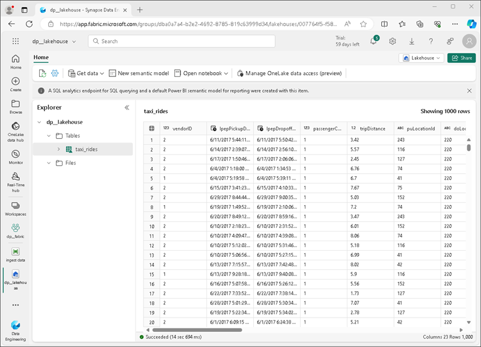
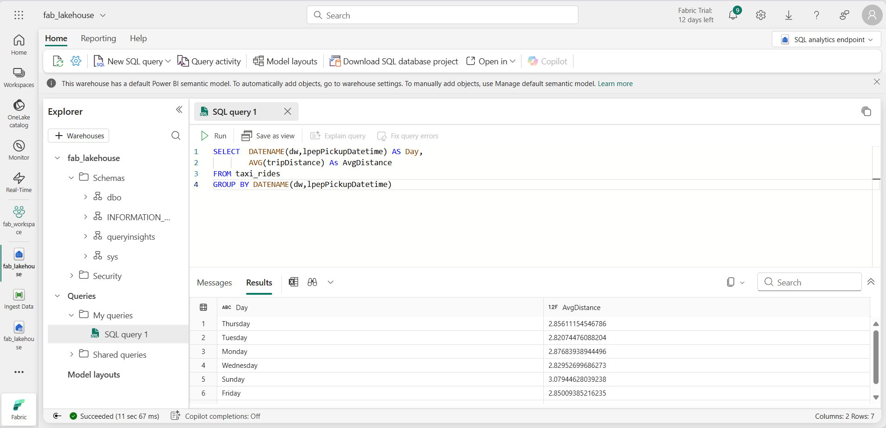
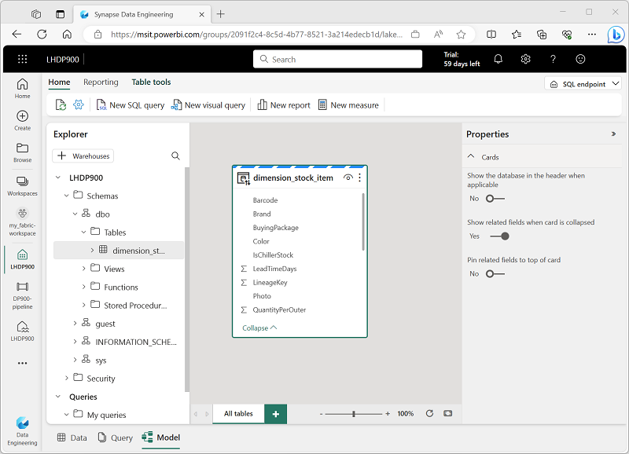

---
lab:
  title: Erkunden von Datenanalysen in Microsoft Fabric
  module: Explore fundamentals of large-scale data analytics
---

# Erkunden von Datenanalysen in Microsoft Fabric

In dieser Übung erkunden Sie die Datenerfassung und -analyse in einem Microsoft Fabric-Lakehouse.

Dieses Lab dauert ungefähr **25** Minuten.

> **Hinweis:** Sie benötigen eine Microsoft Fabric-Lizenz, um diese Übung durchführen zu können. Weitere Informationen zum Aktivieren einer kostenlosen Fabric-Testlizenz finden Sie unter [Erste Schritte mit Fabric](https://learn.microsoft.com/fabric/get-started/fabric-trial). Dazu benötigen Sie ein *Schul-* , *Geschäfts-* oder Unikonto von Microsoft. Wenn Sie über kein Microsoft-Konto verfügen, können Sie sich [für eine kostenlose Testversion von Microsoft Office 365 E3 oder höher registrieren](https://www.microsoft.com/microsoft-365/business/compare-more-office-365-for-business-plans).

## Erstellen eines Arbeitsbereichs

Erstellen Sie vor dem Arbeiten mit Daten in Fabric einen Arbeitsbereich mit aktivierter Fabric-Testversion.

1. Melden Sie sich bei [Microsoft Fabric](https://app.fabric.microsoft.com) unter `https://app.fabric.microsoft.com` an.
2. Wählen Sie auf der Menüleiste auf der linken Seite **Arbeitsbereiche** aus (Symbol ähnelt &#128455;).
3. Erstellen Sie einen neuen Arbeitsbereich mit einem Namen Ihrer Wahl, und wählen Sie im Bereich **Erweitert** einen Lizenzierungsmodus mit Fabric-Kapazitäten aus (*Testversion*, *Premium* oder *Fabric*).
4. Wenn Ihr neuer Arbeitsbereich geöffnet wird, sollte er leer sein.

    

## Erstellen eines Lakehouse

Da Sie über einen Arbeitsbereich verfügen, können Sie nun zu *Datentechnik* im Portal wechseln und ein Data Lakehouse für Ihre Datendateien erstellen.

1. Wechseln Sie unten links im Portal zur **Datentechnik**-Benutzeroberfläche.

    

    Die Datentechnik-Startseite enthält Kacheln zum Erstellen häufig verwendeter Datentechnikressourcen.

2. Erstellen Sie auf der **Datentechnik**-Startseite ein neues **Lakehouse** mit einem Namen Ihrer Wahl.

    Nach etwa einer Minute wird ein neues Lakehouse erstellt:

    

3. Sehen Sie sich das neue Lakehouse an, und beachten Sie, dass Sie im Bereich **Lakehouse-Explorer** auf der linken Seite Tabellen und Dateien im Lakehouse durchsuchen können:
    - Der Ordner **Tables** enthält Tabellen, die Sie mithilfe von SQL abfragen können. Die Tabellen in einem Microsoft Fabric-Lakehouse basieren auf dem *Delta-Lake*-Open-Source-Dateiformat, das üblicherweise in Apache Spark verwendet wird.
    - Der Ordner **Files** enthält Datendateien im OneLake-Speicher für das Lakehouse, die nicht verwalteten Deltatabellen zugeordnet sind. Sie können auch *Verknüpfungen* in diesem Ordner erstellen, um auf extern gespeicherte Daten zu verweisen.

    Derzeit sind keine Tabellen oder Dateien im Lakehouse vorhanden.

## Erfassen von Daten

Eine einfache Möglichkeit zum Erfassen von Daten ist das Verwenden der Aktivität **Daten kopieren** in einer Pipeline, um die Daten aus einer Quelle zu extrahieren und in eine Datei im Lakehouse zu kopieren.

1. Wählen Sie auf der Seite **Start** für Ihr Lakehouse im Menü **Daten abrufen** die Option **Neue Datenpipeline** aus, und erstellen Sie eine neue Datenpipeline mit dem Namen **Ingest Sales Data**.
1. Wählen Sie im **Assistenten zum Kopieren von Daten** auf der Seite **Datenquelle auswählen** das Beispieldataset **Retail Data Model from Wide World Importers** aus.

    

1. Wählen Sie **Weiter** aus, und zeigen Sie die Tabellen in der Datenquelle auf der Seite **Verbindung mit Datenquelle herstellen** an.
1. Wählen Sie die Tabelle **dimension_stock_item** aus, die Produktdatensätze enthält. Wählen Sie dann **Weiter** aus, um zur Seite **Datenziel auswählen** zu gelangen.
1. Wählen Sie auf der Seite **Datenziel auswählen** Ihr vorhandenes Lakehouse aus. Wählen Sie **Weiter**aus.
1. Legen Sie die folgenden Datenzieloptionen fest, und wählen Sie dann **Weiter** aus:
    - **Stammordner**: Tabellen
    - **Einstellungen laden**: In neue Tabelle laden
    - **Name der Zieltabelle**: dimProduct
    - **Spaltenzuordnungen**: *Standardzuordnungen unverändert übernehmen*
    - **Partition aktivieren**: *Nicht ausgewählt*
1. Stellen Sie sicher, dass auf der Seite **Überprüfen _ speichern** die Option **Datenübertragung sofort starten** ausgewählt ist, und wählen **Sie dann Speichern + ausführen** aus.

    Eine neue Pipeline wird wie folgt mit der Aktivität **Daten kopieren** erstellt:

    

    Wenn die Pipeline gestartet wird, können Sie ihren Status im Bereich **Ausgabe** unter dem Pipeline-Designer überwachen. Verwenden Sie das Symbol **&#8635;** (*Aktualisieren*), um den Status zu aktualisieren, und warten Sie, bis der Vorgang erfolgreich abgeschlossen ist.

1. Wählen Sie in der Hubmenüleiste auf der linken Seite Ihr Lakehouse aus.
1. Erweitern Sie dann auf der Seite **Start** im **Lakehouse-Explorer** die Option **Tabellen**, und vergewissern Sie sich, dass die Tabelle **dimProduct** erstellt wurde.

    > **Hinweis**: Wenn die neue Tabelle als *nicht identifiziert* aufgeführt ist, verwenden Sie die Schaltfläche **Aktualisieren** auf der Lakehouse-Symbolleiste, um die Ansicht zu aktualisieren.

1. Wählen Sie die Tabelle **dimProduct** aus, um den Inhalt anzuzeigen.

    

## Abfragen von Daten in einem Lakehouse

Nachdem Sie nun Daten in einer Tabelle im Lakehouse erfasst haben, können Sie diese mithilfe von SQL abfragen.

1. Wechseln Sie oben rechts auf der Lakehouse-Seite zu **SQL-Endpunkt** für Ihr Lakehouse.

    

1. Wählen Sie auf der Symbolleiste **Neue SQL-Abfrage** aus. Geben Sie dann den folgenden SQL-Code in den Abfrage-Editor ein:

    ```sql
    SELECT Brand, COUNT(StockItemKey) AS Products
    FROM dimProduct
    GROUP BY Brand
    ```

1. Wählen Sie die Schaltfläche **&#9655; Ausführen** aus, um die Abfrage auszuführen und die Ergebnisse zu überprüfen. Es sollten zwei Werte für die Marke vorhanden sein (*N/A* und *Northwind*), und es sollte die Anzahl der Produkte der einzelnen Marken angezeigt werden.

    

## Visualisieren von Daten in einem Lakehouse

In Microsoft Fabric-Lakehouses sind alle Tabellen in einem Datenmodell organisiert, und Sie können sie zum Erstellen von Visualisierungen und Berichten verwenden.

1. Wählen Sie unten links auf der Seite im Bereich **Erkunden** die Registerkarte **Modell** aus, um das Datenmodell für die Tabellen im Lakehouse anzuzeigen (in diesem Fall gibt es nur eine Tabelle).

    

1. Wählen Sie auf der Symbolleiste **Neuer Bericht** aus, um eine neue Browserregisterkarte mit dem Power BI-Berichts-Designer zu öffnen.
1. Im Berichts-Designer:
    1. Erweitern Sie im Bereich **Daten** die Tabelle **dimProduct**, und wählen Sie die Felder **Brand** und **StockItemKey** aus.
    1. Wählen Sie im Bereich **Visualisierungen** die Visualisierung **Gestapeltes Balkendiagramm** aus (dies ist die erste aufgeführte Visualisierung). Stellen Sie dann sicher, dass die **Y-Achse** das Feld **Brand** enthält, und ändern Sie die Aggregation in der **X-Achse** in **Count**, sodass sie das Feld **Count of StockItemKey** enthält.
    
        

    > **Tipp**: Sie können die **>>** -Symbole verwenden, um die Bereiche des Berichts-Designers auszublenden und den Bericht übersichtlicher zu gestalten.

1. Wählen Sie im Menü **Datei** die Option **Speichern** aus, um den Bericht in Ihrem Fabric-Arbeitsbereich als **Brand Quantity Report** zu speichern.

    Sie können die Browserregisterkarte mit dem Bericht nun schließen, um zu Ihrem Lakehouse zurückzukehren. Sie finden den Bericht auf der Seite für Ihren Arbeitsbereich im Microsoft Fabric-Portal.

## Bereinigen von Ressourcen

Wenn Sie die Untersuchung von Microsoft Fabric abgeschlossen haben, können Sie den Arbeitsbereich löschen, den Sie für diese Übung erstellt haben.

1. Wählen Sie auf der Leiste auf der linken Seite das Symbol für Ihren Arbeitsbereich aus, um alle darin enthaltenen Elemente anzuzeigen.
2. Wählen Sie im Menü **...** auf der Symbolleiste die **Arbeitsbereichseinstellungen** aus.
3. Klicken Sie im Abschnitt **Andere** auf **Diesen Arbeitsbereich entfernen**.
