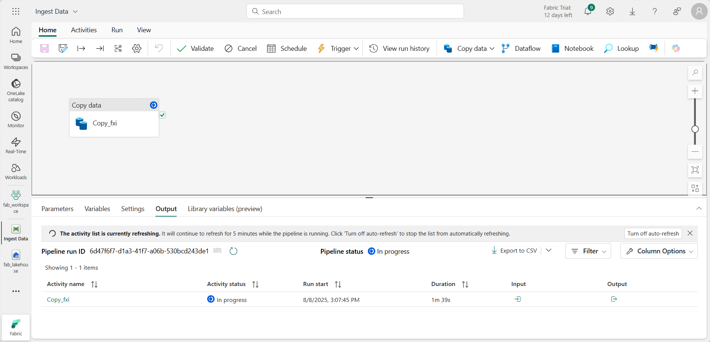

---
lab:
  title: Erkunden von Datenanalysen in Microsoft Fabric
  module: Explore fundamentals of large-scale data analytics
---

# Erkunden von Datenanalysen in Microsoft Fabric

In dieser Übung erkunden Sie die Datenerfassung und -analyse in einem Microsoft Fabric-Lakehouse.

In diesem Lab lernen Sie Folgendes:

- **Grundlegendes zu Lakehouse-Konzepten in Microsoft Fabric**: Erfahren Sie, wie Sie Arbeitsbereiche und Lakehouses erstellen, die für die Organisation und Verwaltung von Datenressourcen in Fabric von zentraler Bedeutung sind.
- **Erfassen von Daten mithilfe von Pipelines**: Verwenden Sie eine geführte Pipeline, um externe Daten in das Lakehouse zu importieren, sodass sie ohne manuelles Codieren für Abfragen bereit ist.
- **Erkunden und Abfragen von Daten mit SQL**: Analysieren Sie erfasste Daten mithilfe vertrauter SQL-Abfragen und gewinnen Sie Erkenntnisse direkt aus Fabric.
- **Verwalten von Ressourcen**: Erfahren Sie mehr über bewährte Methoden zum Bereinigen von Ressourcen, um unnötige Gebühren zu vermeiden.

## Hintergrund zum Dataset „NYC Taxi“:

Das Dataset „NYC Taxi – Green“ enthält detaillierte Aufzeichnungen von Taxifahrten in New York City, einschließlich Abhol- und Ankunftszeiten, Standorte, Streckenlängen, Tarife und Passagieranzahl. Es wird häufig in Datenanalysen und maschinellem Lernen verwendet, um urbane Mobilität, Bedarfsplanung und Anomalieerkennung zu untersuchen. In dieser Übung verwenden Sie dieses reale Dataset, um die Datenerfassung und Analyse in Microsoft Fabric kennenzulernen.

Dieses Lab dauert ungefähr **25** Minuten.

> **Hinweis:** Sie benötigen eine Microsoft Fabric-Lizenz, um diese Übung durchführen zu können. Weitere Informationen zum Aktivieren einer kostenlosen Fabric-Testlizenz finden Sie unter [Erste Schritte mit Fabric](https://learn.microsoft.com/fabric/get-started/fabric-trial). Dazu benötigen Sie ein *Schul-* , *Geschäfts-* oder Unikonto von Microsoft. Wenn Sie über kein Microsoft-Konto verfügen, können Sie sich [für eine kostenlose Testversion von Microsoft Office 365 E3 oder höher registrieren](https://www.microsoft.com/microsoft-365/business/compare-more-office-365-for-business-plans).

*Bei der ersten Verwendung von Microsoft Fabric-Funktionen können Prompts mit Tipps erscheinen. Schließen Sie diese.*

## Erstellen eines Arbeitsbereichs

Erstellen Sie vor dem Arbeiten mit Daten in Fabric einen Arbeitsbereich mit aktivierter Fabric-Testversion.

> _**Tipp**: Ein Arbeitsbereich ist Ihr Container für alle Ressourcen (Lakehouses, Pipelines, Notizbücher, Berichte). Durch Aktivieren der Fabric-Kapazität können diese Elemente ausgeführt werden._

1. Navigieren Sie in einem Browser unter `https://app.fabric.microsoft.com/home?experience=fabric` zur [Microsoft Fabric-Startseite](https://app.fabric.microsoft.com/home?experience=fabric) und melden Sie sich mit Ihren Fabric-Anmeldeinformationen an.

1. Wählen Sie auf der Menüleiste auf der linken Seite **Arbeitsbereiche** aus (Symbol ähnelt &#128455;).

    

1. Erstellen Sie einen neuen Arbeitsbereich mit einem Namen Ihrer Wahl, und wählen Sie im Bereich **Erweitert** einen Lizenzierungsmodus mit Fabric-Kapazitäten aus (*Testversion*, *Premium* oder *Fabric*).

    > _**Tipp** Wenn Sie eine Kapazität auswählen, die Fabric enthält, werden dem Arbeitsbereich die Engines hinzugefügt, die für Datentechnikaufgaben erforderlich sind. Durch die Verwendung eines dedizierten Arbeitsbereichs bleiben Ihre Labressourcen isoliert und einfach zu bereinigen._

1. Wenn Ihr neuer Arbeitsbereich geöffnet wird, sollte er leer sein.

    

## Erstellen eines Lakehouse

Da Sie nun über einen Arbeitsbereich verfügen, ist es an der Zeit, ein Lakehouse für Ihre Datendateien zu erstellen.

> _**Tipp**: Ein Lakehouse führt Dateien und Tabellen auf OneLake zusammen. Sie können Rohdateien speichern sowie verwaltete Delta-Tabellen erstellen, die Sie mit SQL abfragen können._

1. Wählen Sie in der Menüleiste auf der linken Seite **Erstellen** aus. Wählen Sie auf der Seite *Neu* unter dem Abschnitt *Datentechnik* die Option **Lakehouse** aus. Wählen Sie einen eindeutigen Namen Ihrer Wahl aus.

    >**Hinweis**: Wenn die Option **Erstellen** nicht an die Seitenleiste angeheftet ist, müssen Sie zuerst die Ellipses-Option (**…**) auswählen.

    

    Nach etwa einer Minute wird ein neues Lakehouse erstellt:

    

1. Sehen Sie sich das neue Lakehouse an, und beachten Sie, dass Sie im Bereich **Lakehouse-Explorer** auf der linken Seite Tabellen und Dateien im Lakehouse durchsuchen können:
   
    - Der Ordner **Tables** enthält Tabellen, die Sie mithilfe der SQL-Semantik abfragen können. Die Tabellen in einem Microsoft Fabric-Lakehouse basieren auf dem *Delta-Lake*-Open-Source-Dateiformat, das üblicherweise in Apache Spark verwendet wird.
    - Der Ordner **Files** enthält Datendateien im OneLake-Speicher für das Lakehouse, die nicht verwalteten Deltatabellen zugeordnet sind. Sie können auch *Verknüpfungen* in diesem Ordner erstellen, um auf extern gespeicherte Daten zu verweisen.

    Derzeit sind keine Tabellen oder Dateien im Lakehouse vorhanden.

    > _**Tipp**: Verwenden Sie Dateien für Rohdaten oder bereitgestellte Daten und Tabellen für kuratierte, für Abfragen bereite Datasets. Tabellen basieren auf Delta Lake, das heißt sie unterstützen zuverlässige Updates und effiziente Abfragen._

## Einlesen von Daten

Eine einfache Möglichkeit zum Erfassen von Daten ist das Verwenden der Aktivität **Daten kopieren** in einer Pipeline, um die Daten aus einer Quelle zu extrahieren und in eine Datei im Lakehouse zu kopieren.

> _**Tipp**: Pipelines bieten eine geführte, wiederholbare Möglichkeit, Daten in das Lakehouse zu importieren. Sie sind einfacher als von Grund auf zu codieren und können bei Bedarf für später geplant werden._

1. Wählen Sie auf der Seite **Start** für Ihr Lakehouse im Menü **Daten abrufen** die Option **Neue Datenpipeline** aus, und erstellen Sie eine neue Datenpipeline mit dem Namen **Ingest Data**.

    

1. Wählen Sie im Assistenten **Daten kopieren** auf der Seite **Datenquelle auswählen** die Option **Beispieldaten** und wählen Sie dann den Beispieldatensatz **NYC Taxi - Green**.

    

    

1. Auf der Seite **Mit Datenquelle verbinden** können Sie die Tabellen in der Datenquelle anzeigen. Es sollte eine Tabelle geben, die Details zu den Taxifahrten in New York City enthält. Wählen Sie dann **Weiter** aus, um zur Seite **Herstellen einer Verbindung mit dem Datenziel** zu gelangen.

1. Legen Sie auf der Seite **Mit Datenziel verbinden** die folgenden Datenzieloptionen fest, und wählen Sie dann **Weiter** aus:
    - **Stammordner**: Tabellen
    - **Einstellungen laden**: In neue Tabelle laden
    - **Zieltabellenname**: taxi_rides *(Möglicherweise müssen Sie warten, bis die Vorschau der Spaltenzuordnungen angezeigt wird, bevor Sie dies ändern können)*
    - **Spaltenzuordnungen**: *Standardzuordnungen unverändert übernehmen*
    - **Partition aktivieren**: *Nicht ausgewählt*

    

    > _**Warum diese Auswahlmöglichkeiten?**_
    > 
    > _Wir beginnen mit Tabellen als **Stamm**, damit die Daten direkt in eine verwaltete Delta-Tabelle importiert werden, die Sie sofort abfragen können. Wir laden sie in eine **neue Tabelle**, damit dieses Lab eigenständig bleibt und keine vorhandenen Daten überschrieben werden. Wir behalten die **Standardspaltenzuordnungen** bei, da die Beispieldaten bereits der erwarteten Struktur entsprechen. Es ist keine benutzerdefinierte Zuordnung erforderlich. **Die Partitionierung** ist deaktiviert, um für dieses kleine Dataset alles einfach zu halten. Die Partitionierung ist für große Datenmengen nützlich, hier jedoch nicht erforderlich._

1. Stellen Sie sicher, dass auf der Seite **Überprüfen + speichern** die Option **Datenübertragung sofort starten** ausgewählt ist, und wählen **Sie dann Speichern + ausführen** aus.

    > _**Tipp**: Ab sofort können Sie die Pipeline im Einsatz überwachen und überprüfen, ob Daten ohne zusätzliche Schritte eingehen._

    Eine neue Pipeline wird wie folgt mit der Aktivität **Daten kopieren** erstellt:

    

    Wenn die Pipeline gestartet wird, können Sie ihren Status im Bereich **Ausgabe** unter dem Pipeline-Designer überwachen. Verwenden Sie das Symbol **&#8635;** (*Aktualisieren*), um den Status zu aktualisieren, und warten Sie, bis der Vorgang abgeschlossen ist (was 10 Minuten oder länger dauern kann). Dieses spezielle Dataset enthält mehr als 75 Millionen Zeilen und speichert ca. 2,5 Gb an Daten. 

1. Wählen Sie in der Hubmenüleiste auf der linken Seite Ihr Lakehouse aus.

    

1. Wählen Sie auf der **Startseite** im Bereich **Lakehouse-Explorer** im Menü **...** für den Knoten **Tabellen** die Option **Aktualisieren** aus und erweitern Sie dann **Tabellen**, um zu überprüfen, ob die Tabelle **taxi_rides** erstellt worden ist.

    

    > **Hinweis**: Wenn die neue Tabelle als *unbekannt* aufgeführt ist, verwenden Sie die Menüoption **Aktualisieren**, um die Ansicht zu aktualisieren.

    > _**Tipp**: Die Explorer-Ansicht wird zwischengespeichert. Durch das Aktualisieren werden die neuesten Tabellenmetadaten abgerufen, damit die neue Tabelle korrekt angezeigt wird._

1. Wählen Sie die Tabelle **taxi_rides**, um ihren Inhalt anzuzeigen.

    

## Abfragen von Daten in einem Lakehouse

Nachdem Sie nun Daten in einer Tabelle im Lakehouse erfasst haben, können Sie diese mithilfe von SQL abfragen.

> _**Tipp**: Lakehouse-Tabellen sind SQL-freundlich. Sie können Daten sofort analysieren, ohne sie in ein anderes System zu verschieben._

1. Wechseln Sie oben rechts auf der Lakehouse-Seite von der Ansicht **Lakehouse** zum **SQL-Analyse-Endpunkt** für Ihr Lakehouse.

    

    > _**Tipp**: Der SQL-Analyseendpunkt ist für die Ausführung von SQL-Abfragen über Ihre Lakehouse-Tabellen optimiert und in vertraute Abfragetools integriert._

1. Wählen Sie auf der Symbolleiste **Neue SQL-Abfrage** aus. Geben Sie dann den folgenden SQL-Code in den Abfrage-Editor ein:

    ```sql
    SELECT  DATENAME(dw,lpepPickupDatetime) AS Day,
            AVG(tripDistance) As AvgDistance
    FROM taxi_rides 
    GROUP BY DATENAME(dw,lpepPickupDatetime)
    ```

1. Klicken Sie auf die Schaltfläche **&#9655; Ausführen**, um die Abfrage auszuführen und die Ergebnisse zu überprüfen, die die durchschnittliche Fahrtstrecke für jeden Wochentag enthalten sollten.

    > _**Tipp**: Diese Abfrage gruppiert Fahrten nach Tag und berechnet die durchschnittliche Streckenlänge. Dies ist ein einfaches Beispiel für eine Aggregation, auf dem Sie aufbauen können._

    

## Bereinigen von Ressourcen

Wenn Sie die Untersuchung von Microsoft Fabric abgeschlossen haben, können Sie den Arbeitsbereich löschen, den Sie für diese Übung erstellt haben.

> _**Tipp**: Durch das Löschen des Arbeitsbereichs werden alle im Lab erstellten Elemente entfernt. Dies verhindert fortlaufende Gebühren._

1. Wählen Sie auf der Leiste auf der linken Seite das Symbol für Ihren Arbeitsbereich aus, um alle darin enthaltenen Elemente anzuzeigen.

1. Wählen Sie in der Symbolleiste **Arbeitsbereichseinstellungen** aus.

1. Wählen Sie im Abschnitt **Allgemein** die Option **Diesen Arbeitsbereich entfernen** aus.
