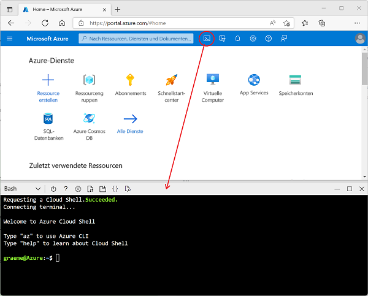

---
lab:
  title: Erkunden von Azure Stream Analytics
  module: Explore data analytics in Azure
---

## Erkunden von Azure Stream Analytics

In dieser Übung stellen Sie einen Azure Stream Analytics-Auftrag in Ihrem Azure-Abonnement bereit und verwenden ihn zum Verarbeiten eines Echtzeitdatenstroms.

> <bpt id="p1">**</bpt>Note<ept id="p1">**</ept>: The exercise is part of a module on Microsoft Learn, and includes an option to use a <bpt id="p2">*</bpt>sandbox<ept id="p2">*</ept> Azure subscription. However, if you are completing this exercise as part of an instructor-led class, you should use the Azure subscription provided as part of the class instead of the sandbox.

Bevor Sie mit der Übung in Microsoft Learn beginnen, müssen Sie eine Cloud Shell-Umgebung für Ihr Azure-Abonnement vorbereiten.

1. Melden Sie sich bei Ihrem Azure-Abonnement im [Azure-Portal](https://portal.azure.com) unter `https://portal.azure.com` mit den Anmeldeinformationen Ihres Azure-Abonnements an.
2. Use the <bpt id="p1">**</bpt>[<ph id="ph1">\&gt;</ph>_]<ept id="p1">**</ept> button to the right of the search bar at the top of the page to create a new Cloud Shell in the Azure portal, selecting a <bpt id="p2">***</bpt>Bash<ept id="p2">***</ept> environment and creating storage if prompted. The cloud shell provides a command line interface in a pane at the bottom of the Azure portal, as shown here:

    

3. Note that you can resize the cloud shell by dragging the separator bar at the top of the pane, or by using the <bpt id="p1">**</bpt>&amp;#8212;<ept id="p1">**</ept>, <bpt id="p2">**</bpt>&amp;#9723;<ept id="p2">**</ept>, and <bpt id="p3">**</bpt>X<ept id="p3">**</ept> icons at the top right of the pane to minimize, maximize, and close the pane. For more information about using the Azure Cloud Shell, see the <bpt id="p1">[</bpt>Azure Cloud Shell documentation<ept id="p1">](https://docs.microsoft.com/azure/cloud-shell/overview)</ept>.

4. Jetzt sind Sie bereit, die Übung auf Microsoft Learn durchzuführen. Verwenden Sie einfach die Cloud Shell in Ihrem Azure-Portal anstelle der (leeren) Shell im Lernmodul (das für Absolventen von Selbstlernkursen mit einem Sandboxabonnement bereitgestellt wird).

    Verwenden Sie den folgenden Link, um die Übung in Microsoft Learn zu öffnen.

    **[Zu Microsoft Learn wechseln](https://docs.microsoft.com/learn/modules/explore-fundamentals-stream-processing/5-exercise-stream-analytics#create-azure-resources)**

> **Weiterführende Informationen**: Wenn Sie später Zeit haben, können Sie zu diesem Microsoft Learn-Modul zurückkehren und die anderen enthaltenen Übungen absolvieren, beispielsweise zum Erkunden von Spark Streaming und Azure Synapse Data Explorer.
