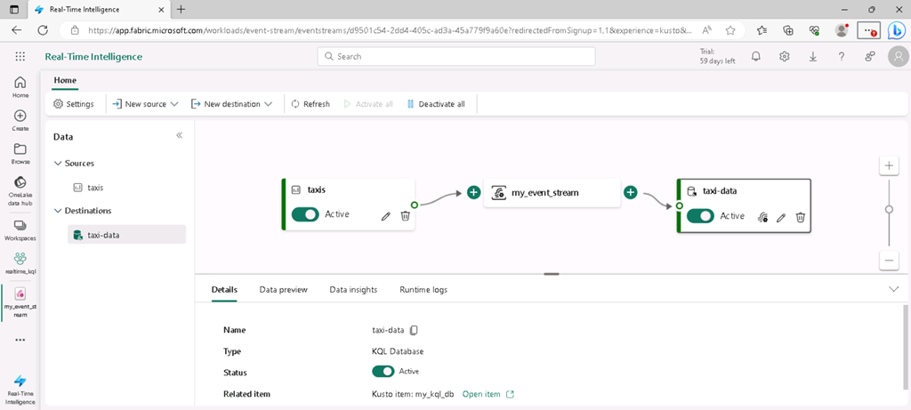

---
lab:
  title: Erkunden von Echtzeitanalysen in Microsoft Fabric
  module: Explore fundamentals of large-scale data analytics
---

# Erkunden von Echtzeitanalysen in Microsoft Fabric

In dieser Übung erkunden Sie Echtzeitanalysen in Microsoft Fabric.

Dieses Lab dauert ungefähr **25** Minuten.

> **Hinweis:** Sie benötigen eine Microsoft Fabric-Lizenz, um diese Übung durchführen zu können. Weitere Informationen zum Aktivieren einer kostenlosen Fabric-Testlizenz finden Sie unter [Erste Schritte mit Fabric](https://learn.microsoft.com/fabric/get-started/fabric-trial). Dazu benötigen Sie ein *Schul-* , *Geschäfts-* oder Unikonto von Microsoft. Wenn Sie über kein Microsoft-Konto verfügen, können Sie sich [für eine kostenlose Testversion von Microsoft Office 365 E3 oder höher registrieren](https://www.microsoft.com/microsoft-365/business/compare-more-office-365-for-business-plans).

## Erstellen eines Arbeitsbereichs

Erstellen Sie vor dem Arbeiten mit Daten in Fabric einen Arbeitsbereich mit aktivierter Fabric-Testversion.

1. Melden Sie sich bei [Microsoft Fabric](https://app.fabric.microsoft.com) unter `https://app.fabric.microsoft.com` an.
2. Wählen Sie auf der Menüleiste auf der linken Seite **Arbeitsbereiche** aus (Symbol ähnelt &#128455;).
3. Erstellen Sie einen neuen Arbeitsbereich mit einem Namen Ihrer Wahl, und wählen Sie im Bereich **Erweitert** einen Lizenzierungsmodus mit Fabric-Kapazitäten aus (*Testversion*, *Premium* oder *Fabric*).
4. Wenn Ihr neuer Arbeitsbereich geöffnet wird, sollte er leer sein.

    

## Erstellen einer KQL-Datenbank

Nachdem Sie nun über einen Arbeitsbereich verfügen, können Sie eine KQL-Datenbank erstellen, um Echtzeitdaten zu speichern.

1. Wechseln Sie unten links im Portal zur Benutzeroberfläche **Echtzeitanalyse**.

    

    Die Startseite von Echtzeitanalysen enthält Kacheln zum Erstellen häufig verwendeter Ressourcen für die Analyse von Echtzeitdaten.

2. Erstellen Sie auf der Startseite von Echtzeitanalysen eine neue **KQL-Datenbank** mit einem Namen Ihrer Wahl.

    Nach etwa einer Minute wird eine neue KQL-Datenbank erstellt:

    

    Derzeit enthält die Datenbank keine Tabellen.

## Erstellen eines Ereignisstreams

Ereignisstreams bieten eine skalierbare und flexible Möglichkeit zum Erfassen von Echtzeitdaten aus einer Streamingquelle.

1. Wählen Sie in der Menüleiste links die Seite **Start** für die Echtzeitanalysen-Benutzeroberfläche aus.
1. Wählen Sie auf der Startseite die Kachel aus, um einen neuen **Ereignisstream** mit einem Namen Ihrer Wahl zu erstellen.

    Nach kurzer Zeit wird der visuelle Designer für Ihren Ereignisstream angezeigt.

    

    Der Zeichenbereich des visuellen Designers zeigt eine Quelle, die eine Verbindung mit Ihrem Ereignisstream herstellt, der wiederum mit einem Ziel verbunden ist.

1. Wählen Sie auf dem Designer-Zeichenbereich in der Liste **Neue Quelle** als Quelle die Option **Beispieldaten** aus. Geben Sie dann im Bereich **Beispieldaten** den Namen **Taxis** an, und wählen Sie die **Yellow Taxi**-Beispieldaten aus (die von Taxifahrten erfassten Daten). Wählen Sie anschließend **Hinzufügen**.
1. Wählen Sie unter dem Designer-Zeichenbereich die Registerkarte **Datenvorschau** aus, um eine Vorschau der aus der Quelle gestreamten Daten anzuzeigen:

    

1. Wählen Sie auf dem Designer-Zeichenbereich in der Liste **Neues Ziel** als Ziel die Option **KQL-Datenbank** aus. Geben Sie dann im Bereich **KQL-Datenbank** den Zielnamen **taxi-data** an, und wählen Sie Ihren Arbeitsbereich und Ihre KQL-Datenbank aus. Wählen Sie dann **Erstellen und konfigurieren** aus.
1. Wählen Sie im **Assistenten zum Erfassen von Daten** auf der Seite **Ziel**die Option **Neue Tabelle** aus, und geben Sie den Tabellennamen **taxi-data** ein. Wählen Sie dann **Weiter: Quelle** aus.
1. Überprüfen Sie auf der Seite **Quelle** den Standardnamen der Datenverbindung, und wählen Sie dann **Weiter: Schema** aus.
1. Ändern Sie auf der Seite **Schema** das **Datenformat** von „TXT“ in **JSON**, und zeigen Sie die Vorschau an, um zu überprüfen, ob dieses Format zu mehreren Datenspalten führt. Wählen Sie anschließend **Weiter: Zusammenfassung** aus.
1. Warten Sie auf der Seite **Zusammenfassung**, bis die fortlaufende Erfassung eingerichtet wurde, und wählen Sie dann **Schließen** aus.
1. Vergewissern Sie sich, dass Ihr abgeschlossener Ereignisstream wie folgt aussieht:

    

## Abfragen von Echtzeitdaten in einer KQL-Datenbank

Ihr Ereignisstream füllt kontinuierlich eine Tabelle in Ihrer KQL-Datenbank auf, sodass Sie die Echtzeitdaten abfragen können.

1. Wählen Sie im Menühub auf der linken Seite Ihre KQL-Datenbank aus (oder wählen Sie Ihren Arbeitsbereich aus, und suchen Sie dort Ihre KQL-Datenbank).
1. Wählen Sie im Menü **...** für die Tabelle **taxi-data** (die von Ihrem Ereignisstream erstellt wurde) die Option **Abfragetabelle > Datensätze, die in den letzten 24 Stunden erfasst wurden** aus.

    

1. Zeigen Sie die Ergebnisse der Abfrage an, bei der es sich um eine KQL-Abfrage wie folgt handelt:

    ```kql
    ['taxi-data']
    | where ingestion_time() between (now(-1d) .. now())
    ```

    Die Ergebnisse zeigen alle in den letzten 24 Stunden von der Streamingquelle erfassten Taxidatensätze an.

1. Ersetzen Sie den gesamten KQL-Abfragecode in der oberen Hälfte des Abfrage-Editors durch den folgenden Code:

    ```kql
    // This query returns the number of taxi pickups per hour
    ['taxi-data']
    | summarize PickupCount = count() by bin(tpep_pickup_datetime, 1h)
    ```

1. Verwenden Sie die Schaltfläche **&#9655; Ausführen**, um die Abfrage auszuführen und die Ergebnisse anzuzeigen, die die Anzahl der Taxifahrten für jede Stunde anzeigen.

## Bereinigen von Ressourcen

Wenn Sie die Untersuchung von Echtzeitanalysen Microsoft Fabric abgeschlossen haben, können Sie den Arbeitsbereich löschen, den Sie für diese Übung erstellt haben.

1. Wählen Sie auf der Leiste auf der linken Seite das Symbol für Ihren Arbeitsbereich aus, um alle darin enthaltenen Elemente anzuzeigen.
2. Wählen Sie im Menü **...** auf der Symbolleiste die **Arbeitsbereichseinstellungen** aus.
3. Klicken Sie im Abschnitt **Andere** auf **Diesen Arbeitsbereich entfernen**.
