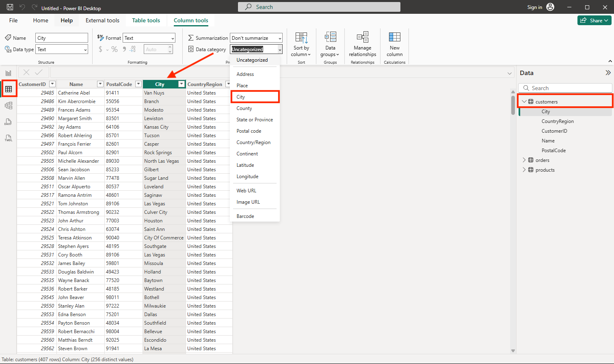

---
lab:
  title: "Erkunden der Grundlagen der Datenvisualisierung mit Power\_BI"
  module: Explore fundamentals of data visualization
---

# Erkunden der Grundlagen der Datenvisualisierung mit Power BI

In dieser Übung erfahren Sie, wie Sie Daten aus mehreren Quellen in Power BI Desktop importieren und modellieren, Beziehungen und Hierarchien für tiefere Analysen erstellen sowie Daten formatieren und kategorisieren, um die Visualisierung zu verbessern. Sie erstellen interaktive Berichte mithilfe von Tabellen, Diagrammen und Karten und erkunden Datenerkenntnisse mithilfe von Drilldowns und übergreifenden Hervorhebungen. Mit diesen Fähigkeiten können Sie Rohdaten in überzeugende visuelle Darstellungen und umsetzbare Business Intelligence umwandeln.

Dieses Lab dauert ungefähr **20** Minuten.

## Installieren von Power BI Desktop

Wenn Microsoft Power BI Desktop noch nicht auf Ihrem Windows-Computer installiert ist, können Sie es kostenlos herunterladen und installieren.

> _**Tipp**: Power BI Desktop ist das Dokumenterstellungstool, in dem Sie Modelle und Berichte lokal erstellen, bevor Sie sie freigeben. Zu Übungszwecken und für die Prototyperstellung ist die Installation kostenlos._

1. Laden Sie das Installationsprogramm für Power BI Desktop von [https://aka.ms/power-bi-desktop](https://aka.ms/power-bi-desktop?azure-portal=true) herunter.

1. Wenn die Datei heruntergeladen wurde, öffnen Sie sie, und verwenden Sie den Setup-Assistenten, um Power BI Desktop auf Ihrem Computer zu installieren. Diese Installation kann einige Minuten dauern.

## Daten importieren

1. Öffnen Sie Power BI Desktop. Die Anwendungsschnittstelle sollte in etwa wie folgt aussehen:

    

    Jetzt sind Sie bereit, die Daten für Ihren Bericht zu importieren.

1. Wählen Sie auf dem Begrüßungsbildschirm von Power BI Desktop die Option **Daten aus anderen Quellen abrufen**, dann in der Liste der Datenquellen die Option **Web** und anschließend **Verbinden** aus.

    

1. Geben Sie im Dialogfeld **Aus dem Web** die folgende URL ein, und wählen Sie dann **OK** aus:

    ```
    https://github.com/MicrosoftLearning/DP-900T00A-Azure-Data-Fundamentals/raw/master/power-bi/customers.csv
    ```

    > _**Tipp**: Die Verwendung des Webconnectors mit CSV-Beispieldateien bedeutet, dass jeder mit denselben bereinigten Daten arbeitet. Lokale Dateien oder Anmeldeinformationen sind nicht erforderlich._

1. Wählen Sie im Dialogfeld „Auf Webinhalt zugreifen“ die Option **Verbinden** aus.

1. Überprüfen Sie, ob die URL ein Dataset mit Kundendaten öffnet, wie unten dargestellt. Wählen Sie dann **Laden** aus, um die Daten in das Datenmodell für Ihren Bericht zu laden.

    

    > _**Tipp**: Das direkte Laden der Daten ist für diese Aufgabe am schnellsten. Sie können später immer noch bei Bedarf Transformationen in Power Query anwenden._

1. Wählen Sie im Hauptfenster von Power BI Desktop im Menü „Daten“ die Option **Daten abrufen** und dann die Option **Web** aus:

    

1. Geben Sie im Dialogfeld **Aus dem Web** die folgende URL ein, und wählen Sie dann **OK** aus:

    ```
    https://github.com/MicrosoftLearning/DP-900T00A-Azure-Data-Fundamentals/raw/master/power-bi/products.csv
    ```

1. Wählen Sie im Dialogfeld die Option **Laden** aus, um die Produktdaten in dieser Datei in das Datenmodell zu laden.

1. Wiederholen Sie die vorherigen drei Schritte, um ein drittes Dataset mit Bestelldaten aus der folgenden URL zu importieren:

    ```
    https://github.com/MicrosoftLearning/DP-900T00A-Azure-Data-Fundamentals/raw/master/power-bi/orders.csv
    ```

    > _**Tipp**: Durch die Einbeziehung von Kunden, Produkten und Bestellungen wird dies ein kleines, realistisches Modell. Mit mehreren verknüpften Tabellen können Sie entitätsübergreifende Analysen durchführen (z. B. Umsatz nach Produktkategorie und Ort)._

## Erkunden eines Datenmodells

Die drei Importierten Datentabellen wurden in ein Datenmodell geladen, das Sie nun erkunden und optimieren werden.

1. Wählen Sie in Power BI Desktop am linken Rand die Registerkarte **Modell** aus, und ordnen Sie die Tabellen im Modell so an, dass sie sichtbar sind. Sie können die Bereiche auf der rechten Seite mithilfe der **>>** -Symbole ausblenden:

    

1. Wählen Sie in der Tabelle **Orders** (Bestellungen) das Feld **Revenue** (Umsatz) aus, und legen Sie dann im Bereich **Eigenschaften** die Eigenschaft **Format** auf **Währung** fest:

    

    Durch diesen Schritt wird sichergestellt, dass die Umsatzwerte in den Berichtsvisualisierungen in der entsprechenden Währung angezeigt werden.

    > _**Tipp**: Formatierungsmaße verbessern die Lesbarkeit in visuellen Elementen und richten Zahlen so aus, wie Geschäftskunden sie sehen._

1. Klicken Sie in der Tabelle der Produkte mit der rechten Maustaste auf das Feld **Kategorie** (oder öffnen Sie dessen Menü **&vellip;** ), und wählen Sie **Hierarchie erstellen** aus. Dieser Schritt erstellt eine Hierarchie namens **Kategoriehierarchie**. Möglicherweise müssen Sie die Ansicht in der Tabelle **products** erweitern oder scrollen, um diese Hierarchie zu sehen. Sie wird auch im Bereich **Felder** angezeigt:

    

1. Klicken Sie in der Produkttabelle mit der rechten Maustaste auf das Feld **ProductName** (oder öffnen Sie das zugehörige Menü **&vellip;** ), und wählen Sie **Zu Hierarchie hinzufügen** > **Kategoriehierarchie** aus. Dadurch wird das Feld **ProductName** (Produktname) zur zuvor erstellten Hierarchie hinzugefügt.

    

1. Klicken Sie im Bereich **Felder** mit der rechten Maustaste auf **Kategoriehierarchie** (oder öffnen Sie das Menü **...**), und wählen Sie **Umbenennen** aus. Benennen Sie die Hierarchie in **Kategorisiertes Produkt** um.

    

    > _**Tipp**: Eine Kategorie→Produkthierarchie ermöglicht Drilldowns in visuellen Elementen, sodass die Betrachter sich von der Zusammenfassung bis hin zum Detail vorarbeiten können._

1. Wählen Sie am linken Rand die Registerkarte **Tabellenansicht** und wählen Sie dann im Bereich **Daten** die Tabelle **Kundschaft**.

1. Wählen Sie die Spaltenüberschrift **City** (Stadt) aus, und legen Sie die Eigenschaft **Datenkategorie** auf **City** (Stadt) fest:

    

    Durch diesen Schritt wird sichergestellt, dass die Werte in dieser Spalte als Städtenamen interpretiert werden, was nützlich sein kann, wenn Sie Kartenvisualisierungen verwenden möchten.

    > _**Tipp**: Datenkategorien helfen Power BI dabei, Standorte korrekt geografisch zu codieren, sodass Punkte in Kartenvisualisierungen an den richtigen Positionen angezeigt werden._

## Erstellen eines Berichts

Jetzt sind Sie fast so weit, einen Bericht zu erstellen. Zunächst müssen Sie einige Einstellungen überprüfen, um sicherzustellen, dass alle Visualisierungen aktiviert sind.

1. Wählen Sie im Menü **Datei** die Option **Optionen und Einstellungen** aus. Wählen Sie dann **Optionen** aus, und vergewissern Sie sich im Abschnitt **Sicherheit**, dass die Option **Verwenden von Kartenvisuals und Flächenkartogrammen** aktiviert ist, und wählen Sie **OK** aus.

    

    Durch diese Einstellung wird sichergestellt, dass Sie Kartenvisualisierungen in Berichte aufnehmen können.

    > _**Tipp**: Kartenvisualisierungen sind in einigen Umgebungen deaktiviert. Wenn Sie sie aktivieren, wird die Kartenvisualisierung in Ihrem Visualisierungsbereich angezeigt._

1. Wählen Sie auf der linken Seite die Registerkarte **Berichtansicht** aus, um die Benutzeroberfläche für den Berichtsentwurf anzuzeigen.

    

1. Wählen Sie im Menüband oberhalb der Berichtsentwurfsoberfläche **Textfeld** aus, und fügen Sie dem Bericht ein Textfeld mit dem Text **Sales Report** (Umsatzbericht) hinzu. Formatieren Sie den Text so, dass er fett angezeigt wird und einen Schriftgrad von 32 hat.

    

    > _**Tipp**: Ein eindeutiger Titel hilft Benutzern, den Zweck des Berichts auf einen Blick zu verstehen._

1. Wählen Sie einen leeren Bereich im Bericht aus, um die Auswahl des Textfelds aufzuheben. Erweitern Sie dann im Bereich **Daten** das Feld **Products** (Produkte), und wählen Sie das Feld **Categorized Products** (Kategorisierte Produkte) aus. Durch diesen Schritt wird dem Bericht eine Tabelle hinzufügt.

    

    > _**Tipp**: Mithilfe des Hierarchiefelds können Sie jetzt zu Visualisierungen wechseln, die Drilldowns nahtlos unterstützen._

1. Mit weiterhin ausgewählter Tabelle erweitern Sie im Bereich **Daten** den Bereich **Orders** (Bestellungen), und wählen Sie **Revenue** (Umsatz) aus. Eine Spalte „Revenue“ (Umsatz) wird der Tabelle hinzugefügt. Möglicherweise müssen Sie die Größe der Tabelle erweitern, damit sie sichtbar wird.

    Der Umsatz wird in der Währung formatiert, die Sie im Modell angegeben haben. Allerdings haben Sie die Anzahl der Dezimalstellen nicht angegeben, sodass die Werte auch Bruchbeträge enthalten. Für die Visualisierungen, die Sie erstellen werden, spielt das keine Rolle, aber Sie können zur Registerkarte **Modell** oder **Daten** wechseln und bei Bedarf die Dezimalstellen ändern.

    

1. Wählen Sie bei ausgewählter Tabelle im Bereich **Visualisierungen** die Visualisierung **Gestapeltes Säulendiagramm** aus. Die Tabelle wird in ein Säulendiagramm geändert, in dem der Umsatz nach Kategorie angezeigt wird.

    

    > _**Tipp**: Ein Säulendiagramm erleichtert es, Kategorien nebeneinander zu vergleichen._

1. Wählen Sie oberhalb des ausgewählten Säulendiagramms das Symbol **&#8595;** aus, um den Drilldown zu aktivieren. Wählen Sie in der Tabelle eine beliebige Spalte aus, um einen Drilldown auszuführen und den Umsatz für die einzelnen Produkte in dieser Kategorie anzuzeigen. Diese Funktion ist möglich, da Sie eine Hierarchie von Kategorien und Produkten definiert haben.

    

    > _**Tipp**: Drilldown zeigt Details bei Bedarf an, ohne die Ansicht zu überladen – perfekt für tiefere Einblicke._

1. Verwenden Sie das Symbol **&#x2191;** , um einen Drillup zur Kategorieebene durchzuführen. Wählen Sie dann das Symbol **(** &#8595; **)** aus, um das Drilldownfeature zu deaktivieren.

1. Wählen Sie einen leeren Bereich des Berichts aus, und wählen Sie dann im Bereich **Daten** das Feld **Menge** in der Tabelle **Orders** (Bestellungen) und das Feld **Category** in der Tabelle **Products** (Produkte) aus. Dieser Schritt führt zu einem weiteren Säulendiagramm, das die Umsatzmenge nach Produktkategorie zeigt.

1. Wählen Sie bei ausgewähltem neuen Säulendiagramm im Bereich **Visualisierungen** die Option **Kreisdiagramm** aus, ändern Sie dann die Größe des Diagramms, und positionieren Sie es neben dem Säulendiagramm für den Umsatz nach Kategorie.

    

    > _**Tipp**: Die Anzeige der Menge nach Kategorie als Kreisdiagramm hebt den proportionalen Beitrag hervor und ergänzt das Umsatzspaltendiagramm._

1. Wählen Sie einen leeren Bereich des Berichts aus, und wählen Sie dann im Bereich **Daten** das Feld **City** (Stadt) in der Tabelle **Customers** (Kunden) und das Feld **Revenue** (Umsatz) in der Tabelle **Orders** (Bestellungen) aus. Dies führt zu einer Karte mit dem Umsatz nach Stadt. Sie können die Visualisierungen nach Bedarf neu anordnen und ihre Größe anpassen:

    

    > _**Tipp**: Das Zuordnen von Umsätzen nach Ort ermöglicht eine geografische Aufschlüsselung. So sind Muster, die in Tabellen oder Diagrammen nicht offensichtlich sind, auf einer Karte zu erkennen._

1. Beachten Sie, dass Sie auf der Karte ziehen, doppelklicken, ein Mausrad verwenden oder auf einem Touchscreen entsprechend Ausschnitte verkleinern und vergrößern können, um zu interagieren. Wählen Sie dann eine bestimmte Stadt aus, und beachten Sie, dass die anderen Visualisierungen im Bericht geändert werden, um die Daten für die ausgewählte Stadt hervorzuheben.

    

    > _**Tipp**: Durch übergreifende Hervorhebungen können Benutzer mit einem visuellen Element interagieren und damit verbundene Änderungen auf der Seite sehen. Dadurch wird ein statischer Bericht zu einer interaktiven Oberfläche._

1. Klicken Sie im Menü **Datei** auf **Speichern**. Speichern Sie dann die Datei unter einem geeigneten PBIX-Dateinamen. Sie können die Datei öffnen und die Datenmodellierung und -visualisierung in aller Ruhe weiter erkunden.

    > _**Tipp**: Beim Speichern eines PBIX-Steuerelements bleiben Ihr Modell, Ihre Abfragen und Ihre Berichte zusammen, damit Sie es später erneut öffnen und durchlaufen lassen können._

Wenn Sie über ein Abonnement des [Power BI-Diensts](https://www.powerbi.com/?azure-portal=true) verfügen, können Sie sich bei Ihrem Konto anmelden und den Bericht in einem Power BI-Arbeitsbereich veröffentlichen. 

> **Tipp**: Mit der Veröffentlichung im Power BI-Dienst können Sie den Bericht freigeben, die Aktualisierung planen und mit anderen in Ihrem Arbeitsbereich zusammenarbeiten.
